# 大模型MoE原理+代码手撕版

大家好，时隔不知多少月，LLM并行训练系列终于又有更新了（抱头防打），这一章我们来讲MoE并行，同样分为**原理篇和源码篇**做讲解。

**关于MoE并行，我体感最深的一点是，它的定义不像tp/dp/pp这类典型的并行方式那样清晰明确**，表现在：

- 对MoE并行相关的术语定义，各个论文/代码鱼龙混杂，有时根本不给定义直接甩出名词，有时相同的名词甚至代表不同的含义，给人造成极大困扰（举个最简单的例子，说说什么叫EP？）
- 对MoE并行的代码实现，不同框架间存在较多差异，有些框架还做了前提假设，导致在阅读源码过程中难以做知识迁移。

总结起来，MoE相关的开源资料，都透露着一股浓浓的禅意，这就好像你和老板的日常对话：你：“老板，这事急吗？” 老板：“如急，懂否？” 你：“如懂。” 所以参悟的最好办法，就是去看源码实践了。

本文是在阅读DeepSpeed-Megatron / Megatron / Fairscale / Tutel等开源框架代码后总结而成，**最终选择以DeepSpeed实现原理为主线，其余框架实现原理为辅线进行讲解**，全文架构如下：

- **第一部分**，介绍选择DeepSpeed实现方式的原因
- **第二部分**，介绍以Gshard为代表的MoE模型架构。如果你不想了解MoE分布式训练，只想知道MoE模型长什么样，是如何运作的，可以只看这部分
- **第三部分**，介绍MoE并行训练中的分布式初始化。阅读本章需要对Megatron混合并行原理和Megatron源码架构有了解。
- **第四部分**，源码解读。这个放在下篇中做讲解


# 一、为什么选择DeepSpeed-Megatron

引入MoE并行训练的框架有很多，为什么这篇文章选择用DeepSpeed来做讲解呢？主要原因如下：

- **使用DeepSpeed做讲解时，可将其MoE实现作为主线，其余框架MoE实现作为分支，这样方便在讲解主线的同时，引入分支进行对比。**之所以DeepSpeed能成为主线，是因为它的MoE代码是一个**“大杂汇”**，例如，它的MoE初始化设置借鉴了Megatron，它的MoE-Layer架构借鉴了Fairscale，它的MoE优化方式借鉴了Tutel等，在这些借鉴之上，它引入了自己的一些改进。所以使用DeepSpeed，更方便我们做对比讲解。
- **DeepSpeed的MoE模型架构是Gshard**。作为最早将MoE应用在Transformer上的模型，Gshard提出的框架和思想一直影响至今。后续我们看到的很多LLM MoE的架构改进，其实都是在Gshard的这一套逻辑上做的迭代，比如loss改造、topKexpert的选择，稀疏矩阵计算优化等等。所以从Gshard入手，更利于我们对基础的把握。

# 二、Gshard架构

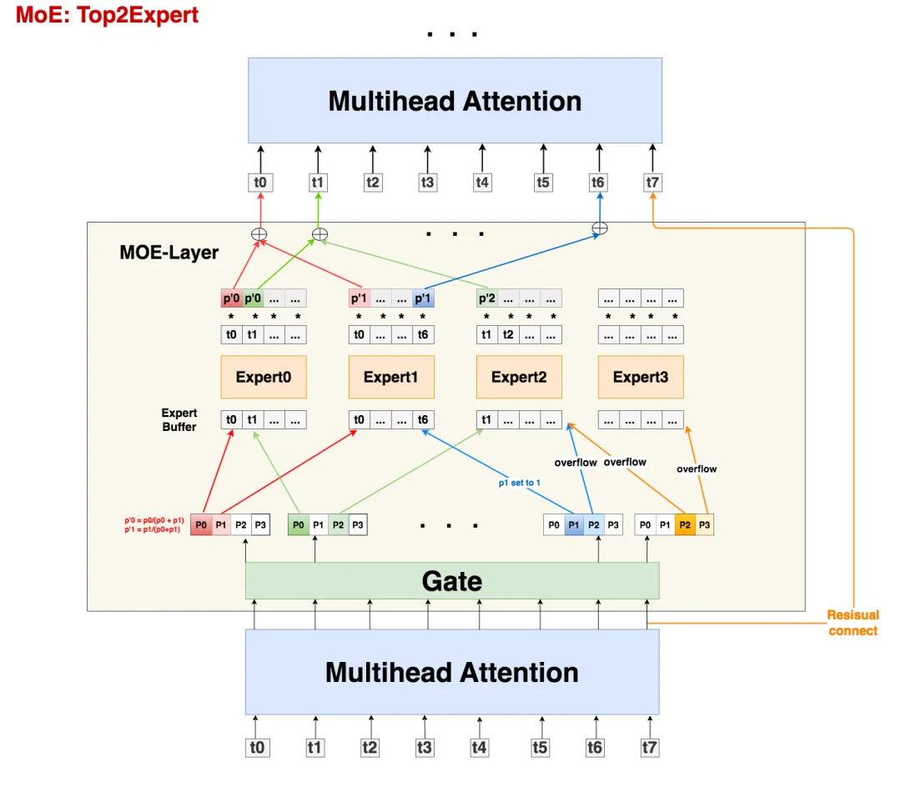

## 2.1 直觉上理解MoE设计

从架构图中我们可以发现，MoE其实就是将Transformer中的FFN层替换成了MoE-layer，其中每个MoE-Layer由一个gate和若干个experts组成。**这里gate和每个expert都可以理解成是****`nn.linear`形式的神经网络。**

**这样设计的直觉是什么呢？**

- `expert`：**术业有专攻**。假设我的输入数据是“我爱吃炸鸡”，在原始的Transformer中，我们把这5个token送去一个FFN层做处理。但是现在我们发现这句话从结构上可以拆成“主语-我”，“谓语-爱吃”，“宾语-炸鸡”，**秉持着术业有专攻的原则，我把原来的1个FFN拆分成若干个expert，**分别用来单独解析“主语”，“谓语”，“宾语”，这样可能会达到更好的效果。
- `gate`：**那么我怎么知道要把哪个token送去哪个expert呢**？很简单，我再训练一个gate神经网络，让它帮我判断就好了。

当然，这里并不是说expert就是用来解析主谓宾，只是举一个例子说明：**不同token代表的含义不一样，因此我们可以用不同expert来对它们做解析。除了训练上也许能达到更好的效果外，MoE还能帮助我们在扩大模型规模的同时保证计算量是非线性增加的**（因为每个token只用过topK个expert，不用过全量expert），这也是我们说MoE-layer是稀疏层的原因。

最后需要注意的是，**在之前的表述中，我们说expert是从FFN层转变而来的，这很容易让人错理解成expert就是对FFN的平均切分，实际上你可以任意指定每个expert的大小，**每个expert甚至可以>=原来单个FFN层，这并不会改变MoE的核心思想：token只发去部分expert时的计算量会小于它发去所有expert的计算量。

接下来，我们来看上图中MoE的各部分细节，下文中所有的符号遵从Gshard论文表示。

## 2.2 输入数据

首先，所有tokens正常过Attention层得到MoE-layer的输入，我们记输入数据的尺寸为`(S, M)`，其中:

- S : 输入batch中的token数量，例如图中S=8
- M: token_embedding维度

需要注意的是，我们一般是**以batch的形式**组织输入数据的（图中batch_size = 1），假设Attention层输入数据的维度是`(batch_size, seq_len, M)`，那么有`S = batch_size * seq_len`

## 2.3 Gate

接下来，我们就要使用线形层Gate帮助我们判断token应该送去哪个expert了。**在别的MoE架构中，Gate有时也被称为Router（路由）**。Gate的尺寸大小为`(M, E)`，其中E表示expert的数量。

输入数据`(S, M)`过Gate`(M, E)`后，得到**prob数据`(S, E)`**，它的含义是：每个token去向每个expert的概率。

**由于在Gshard中我们使用的是top2Expert，因此对每个token，我们只关心它概率最大的两个expert**。在图中，我们用深色表示最大概率，浅色表示次大概率。例如对token0来说，它被送去expert0的概率最大，被送去expert1的概率次大。

好，现在既然知道每个token的top2Expert了，是不是就可以直接发送了呢？别急，我们先来看看Expert的架构。

## 2.4 Expert与溢出处理

我们知道，token发去expert的概率不是我们能控制的，在实际操作中，**可能某些expert接收到了好多token，而某些expert接收的token寥寥无几，**我们管这种现象叫**expert负载不均**。这种情况不仅不符合我们MoE的设计初衷（术业有专攻），还影响计算效率（例如引起分布式训练中各卡通讯时的负载不均），所以我们急需想办法**缓解**这种问题，Gshard就提出了以下几种解决办法：

### （1） capacity和capacity factor

在图中，你会看到一个叫**Expert buffer**的东西，这是什么呢？

在上文中我们提到，有些expert可能接收到非常多的token，为了缓解这个问题，我们可以给每个expert设置一个**容量值（capacity）**，如果当前这个expert接收到的token数已经超过了容量，那么它就不再接收token了，此时我们称这个多出来的token为**溢出(overflow)。**

**那么容量应该怎么设置呢？**在我们的例子中，一共有8个token和4个expert，在理想的负载均衡的情况下，每个expert应该接收8/4 = 2个token，考虑到这里采用的是top2Expert，因此最终每个expert接收的token上限最好是(8/4)*2 = 4，**这也是我们图中expert buffer的长度。**

但这并不说明capacity一定要是。我们可以在此基础上使用capacity factor，根据需要让每个expert多处理或少处理一些token；你甚至还能设置一个容量下界(min_capacity)，**所以最终capacity可以按如下式子定义：**


回到图中的例子上来，我们发现t0和t1都正常发去top2Expert上了。但是对于t6，它的2nd expert已经装满了；对于t7，它的1st和2nd expert都满了。**所以t6和t7都发生了溢出。那么我们要怎么处理溢出的情况？**别着急，我们马上来看。

### （2） Random Routing

对于一个token，我们一定要把它发到top2Expert上吗？

**从直觉上对于每个token，我们最好将其以100%的概率发去1st expert；但是对于它的2nd expert，我们可以不100%发送，而是以一定的概率**（例如从uniform(0,1)中随机抽取一个数p，将其作为概率）发送，这样不就能节省对expert capacity的消耗，从而更好利用每个expert吗？这也是Gshard论文中提出的方法。

**而我们下文要讲的DeepSpeed代码，在这一块又做了稍微不同的处理**：以图中t0为例，1st expert它是肯定要发去的。但是在选择2nd expert时，它做了一些加噪处理：对产出的每个概率（更确切地说是logit），它从某种分布中采样4个噪声，加在这4个logit上，然后mask掉1st expert位置的logit，再从剩下3个logit中找到最大的作为其2nd Expert。

现在我们已经选出最终的top2Expert，我们再回到没有加噪时的4个概率上，取出相应位置的概率，做normalize计算：


**是一种权重（weight），该token过expert0和expert1后会分别得到一个输出token，我们可以对2个输出token做加权计算，得到最终的输出token。**

**回到上面的问题，token发生溢出时，要怎么办呢？**

- **如果只有单个expert溢出**，那么就把另一个expert的权重值为1，然后正常参与加权计算（如图中t6）
- **如果2个expert都溢出**，那么该token就不经过任何expert，直接通过残差连接的方式，原样发去下一层的Attention上（如图中t7）

### （3） Auxiliary Loss

除了capacity和random routing外，Gshard还通过增加一项辅助损失函数(Auxiliary Loss)来尽量保证Expert的负载均衡，其定义如下：


其中：

- ：专家数量
- ：某个专家的buffer中已经存下的token数量（一般指该专家作为1st专家时接收到的token数）
- ：总token数量
- ：某个专家的buffer中已经存下的token在该专家上的avg(weight)（token考虑范围也是那些将该专家作为1st专家的token）

**我们将这个辅助损失添加在正常loss之后，我们的目标也是最小化这个辅助损失**。这个辅助损失设计已经非常直觉，就不过多阐述了。值得一提的是，之所以引入项，是为了让辅助损失函数可以bwd求导（因为只考虑这项，它受制于argmax，是不可求导的，实在难理解也没关系，记住就好）。

## 2.5 Zero Padding和Drop tokens

**写到这里，我们稍微总结下：**

- 首先，我们有一串过Attention层后的token序列

- 我们通过Gate，计算每个token去往每个expert的概率

- 我们希望不同expert处理的token数尽量均衡，所以我们同时采取三方面优化：

- - **Capacity:** 为每个expert设置capacity（expert buffer），限制它能处理的最大token数量，多出来的token算为溢出，在top2Expert都溢出的情况下，该token会被直接发去下一层attention。
  - **Random Routing**: 每个token一定会被发去1st Expert，在此基础上我们通过random routing加噪的方式，重新选出2nd expert。**在做完capacity + random routing后，我们最终确认了每个token要发去的top2expert和其对应的权重，通过加权计算的方式，确认Moe-Layer最终的输出结果。**
  - **Auxiliary Loss**：添加辅助损失函数，对expert负载不均的情况做进一步惩罚。

到这里，Gshard MoE的核心架构内容我们就说完了，最后再提2点：

### （1）Zero padding

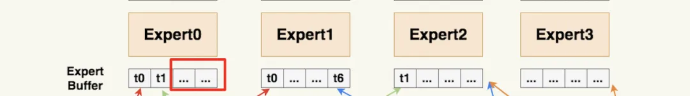

**我们上述的优化方法，只能“缓解”负载不均，而不能保证解决负载不均**。也就是说，存在一些Expert，它的Expert buffer没有填满，这可怎么办呢？

**最直接的方法，就是在没有buffer中空出来的位置，用0向量填充，我们称为Zero padding。**更具体地说，最终每个expert上的输入数据维度为`(E, C, M)`，其中C表示capacity。0填充的好处是，我们保证每个expert上要处理的输入数据维度是一样的，这有利于硬件层面的后续处理（例如多卡通讯间的负载均衡等）。

### （2）Drop tokens

我们知道，当发生溢出情况时，不是所有token都会被expert正常处理的，**我们称这种对溢出的操作为drop tokens**。如果被drop掉的tokens数量太多，也是一种信息损失（它们都没经过任何expert解析），我们当然可以通过调整capacity来缓解这个问题，但过大的capacity会引起更严重的zero padding问题（影响到矩阵的稀疏程度），所以这也是后续一些MoE模型架构侧重的优化。

## 2.6 伪代码

现在我们将整个过程以伪代码的形式写出（大家注意看注释细节）。这里在Gshard论文提供的伪代码上，按照deepspeed的实现方式做了些修正。

```
# -------------------------------------------------------------------------------------
# 1.通过gate，计算每个token去到每个expert的概率
# 
# 【input】：Attention层输出的一整个batch的token，其尺寸为(seq_len, batch_size, M),
#             其中M表示token_embedding
# 【reshaped_input】：由input做reshape而来，尺寸为(S, M), 其中S = seq_len * batch_size
# 【Wg】: gate的权重，尺寸为(M, E)，其中E表示MoE-layer层的专家总数
# 【gates】: 每个token去到每个expert的概率，尺寸为(S, E)
# -------------------------------------------------------------------------------------
M = input.shape[-1]
reshape_input = input.reshape(-1, M)

gates = softmax(enisum("SM, ME -> SE"), reshape_input, Wg)

# -------------------------------------------------------------------------------------
# 2. 确定每个token最终要去的top2Expert，并返回对应的weight和mask
#
# 【combine_weights】：尺寸为(S, E, C)，其中C表示capacity（Expert buffer）。
#                     表示对每个token（S）而言，它对每个专家（E）的weight，而这个weight按照
#                     该token在buffer中的位置（C）存放，不是目标位置的地方则用0填充
#                     例如图中token1，它将被发送到expert0和expert2，且它在expert0的buffer中排在
#                     1号位置，在expert2中排在0号位置，那么token1的combine_weights就是：
#                     [[0., p0, 0., 0.],
#                     [0. , 0.,  0., 0.],
#                     [p2, 0.,  0., 0.],
#                     [0.,  0.,  0., 0.]]
#                     最后再复习一下weight和gates所表示的prob的区别：前者是在后者基础上，
#                     做了random + normalize，确定最终的top2Expert后返回的对应结果
# 
# 【dispatch_mask】：  尺寸为（S，E，C），它等于combine_weights.bool(), 也就是对combine_weights
#                     为0的地方设为False，为1的地方设为True。
#                     dispatch_mask后续将被用在zero padding上
# -------------------------------------------------------------------------------------
# (S, E, C)      (S, E, C)
combine_weights, dispatch_mask = Top2Gating(gates)


# -------------------------------------------------------------------------------------
# 3. 将输入数据按照expert的顺序排好，为下一步送去expert计算做准备（很重要）
# 
# 【dispatch_mask】：尺寸为（S, E, C），定义参见2
# 【reshape_input】：尺寸为(S, M)，定义参见1
# 【dispatched_expert_input】：本步的输出结果，表示按专家排序好的输入数据，尺寸为(E, C, M)
#  这个结果表示，每个专家（E）的buffer（C）下要处理的token_embedding（M），
#  例如dispatched_expert_input[0]就表示expert0 buffer中的情况
#  注意：
#  （1）每个专家buffer中的token是按顺序排列好的，
#       回到图中的例子，expert0 buffer下0号位置排的是token0，
#       3号位置排的是token6，以此类推。dispatch_mask就起到了维护这种顺序的作用
#  （2）当对应专家接收的token数不足buffer长度C时，不足的地方用0向量填充。
# -------------------------------------------------------------------------------------
dispatched_expert_input = einsum("SEC, SM -> ECM", dispatched_mask, reshape_input)

# -------------------------------------------------------------------------------------
# 4. 将排序好的input送入expert进行计算。
#    同正常的FFN层一样，每个expert也由2个线形层Wi, Wo组成
# 【dispatched_expert_input】：按专家顺序和专家buffer中的token顺序排好的输入数据，
#                             尺寸为(E, C, M)，具体定义见3
# 【Wi】：experts的Wi层，尺寸为(E，M, H)，
# 【Wo】：experts的Wo层，尺寸为(E, H, M)
# 【expert_outputs】：experts的输出结果，不含加权处理，尺寸为（E, C, M）
# -------------------------------------------------------------------------------------
h = enisum("ECM, EMH -> ECH", dispatched_expert_input, Wi)
h = relu(h)
expert_outputs = enisum("ECH, EHM -> ECM", h, Wo)

# -------------------------------------------------------------------------------------
# 5. 最后，进行加权计算，得到最终MoE-layer层的输出
# -------------------------------------------------------------------------------------
outputs = enisum("SEC, ECM -> SM", combine_weights, expert_outputs)
outputs_reshape = outputs.reshape(input.shape) # 从(S, M)变成(seq_len, batch_size, M)
```

再特别说明几点

#### （1）enisum的作用

- **enisum在这里泛指我们自定义的某几种矩阵计算方式**，enisum中诸如"SEC, SM -> ECM"只是用来表示输入数据和输出数据的维度，并不表示两个输入矩阵就一定是按照SEC和SM这样的尺寸直接相乘（我们肯定要对输入数据做些例如unsqeeze()，reshape()之类的操作才能把它们正确乘起来，得到想要的结果）
- **enisum使得我们在矩阵计算的同时，能维持token和expert的顺序。**你可能在阅读伪代码的过程中已经感受到，维持“顺序”是一件很重要的事，例如token在专家buffer中的顺序，各个专家间的排序等。为什么维持顺序很重要呢？**因为一个batch里有很多token，我们将其发往不同的expert做计算后，输出结果的顺序肯定是打乱的，所以需要通过一种方式追踪顺序，把token permute回正常的位置再输入下一层Attention。在这里我们通过自定义的矩阵计算方式，巧妙维护住这种顺序，这样我们就不需要额外建索引表之类的来查找了。**

在后文对deepspeed的源码解读中，我们会看到enisum的具体定义。不过这块不是源码解读的讲述重点（毕竟也只是矩阵计算而已）。对这块有兴趣的朋友，可以自己攥一些数据跑跑代码，研究它的运作原理。不感兴趣的朋友，只要记住输入输出的尺寸及各自含义即可。

#### （2）将输入数据按照expert的顺序排好

大家可以特别关注下伪代码步骤3中的操作，这个操作将有利于后续专家并行组之间的通讯。

# 三、MoE并行训练

正如前文所说，**阅读本章需要了解Megatron混合并行原理，并掌握其代码中“分布式初始化”部分的相关知识。**

当我刚开始研究MoE时，总会看到类似`EP + DP`，`EP + TP + DP`这样并行方式的缩写，例如DeepSpeed官方文档中所描述的。最开始我对这个符号的理解是：非MoE层的部分采取DP或DP+TP的方式；而MoE层的部分采取一种叫EP的新方式。然而当我把这样的理解代入代码中时，却发现有些部分难以解释。

**摸索了一段时间后，我才发现不管是****`EP + DP`，`EP + TP +DP`等等，它们都在特指MoE层的并行方式；而对non-MoE层，你采取什么样的并行方式，是不在这些并行符号的表示范围中的。**

我们以`EP + DP`，`EP + TP + DP`这两种方式为例，来看看如何对MoE模型做分布式初始化。

## 3.1 EP + DP

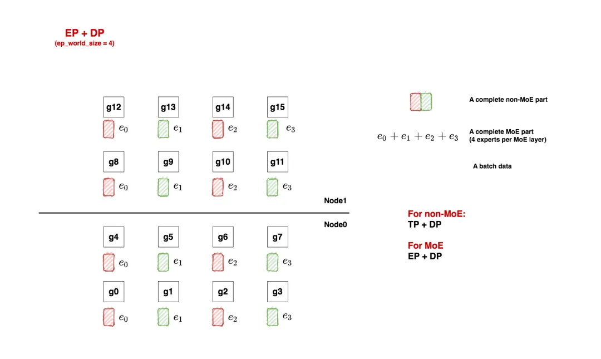

如上图，我们先来看一个例子。在本例中，我们共有**16块gpu**：

- **对于non-moe的部分，采取tp + dp并行**
- **对于moe部分，采取ep + dp并行。**

### （1）Non-MoE: tp + dp

non-moe的部分指模型中Attention、word embedding层等。tp + pp 的并行方式我们也很熟悉了，根据图中所示，我们有：

```
tp_world_size = 2
tp_groups = [
             [g0,  g1],[g2, g3], [g4, g5], [g6, g7],
             [g8,  g9],[g10, g11],[g12, g13],[g14, g15]
            ]

dp_world_size = 8
dp_groups = [
              [g0, g2, g4, g6, g8, g10, g12, g14],
              [g1, g3, g5, g7, g9, g11, g13, g15]
            ]

pp_world_size = 1
```

### （2）MoE: ep + dp

当我们安顿好non-moe的部分后，我们就可以开始考虑要怎么安排MoE层了，这里我们先给出划分方法，然后再对其进行详细解释：

```
ep_world_size = 4
ep_groups = [
             [g0,    g1,    g2,     g3 ],
             [g4,    g5,    g6,     g7],
             [g8,    g9,    g10,  g11],
             [g12,  g13,  g14,  g15]
            ]

ep_dp_world_size = 4
ep_dp_groups = [
                 [g0,   g4,   g8,   g12],
                 [g1,   g5,   g9,   g13],
                 [g2,   g6,   g10, g14],
                 [g3,   g7,   g11, g15]
                 ]

ep_tp_world_size = 1
```

还记得前面我们说MoE层采用的是`EP + DP`并行吗？那么这里的EP和DP的定义到底是什么呢？

**假设我们每个MoE层有若干个专家（我们统称其为一套专家），现在我们想把这一套专家分布排列到gpu上，最直觉的做法就是：我们先定好要用几块GPU装下一套专家（EP），进而我们就能确认全局上共有多少套专家副本在跑（DP）。**通过这种简单的方式，我们就做好了EP + DP形式的MoE层初始化。

回到我们的例子中，一共16块GPU：

- **ep_world_size = 4**：表示我们希望用4块GPU装下一套完整的专家。确定这个数值后，我们就能确认ep_groups
- **local_expert_num**：expert_num / ep_world_size，其中expert_num表示每层专家的总数。假设每层专家数量是4，那么1块gpu上就放一个专家；假设每层专家数量是8，那么1块gpu上就放2个专家。所以图中的e0等符号并不绝对表示这里只有1个专家，只是对local_expert的统称。
- **ep_dp_world_size：**类比于non-MoE层，MoE层同样也有数据并行的概念。例如图中[g0, g4, g8, g12]上都维护着e0，所以它们构成一个**ep_dp_group。这个group的作用是当我们在计算bwd时，它们之间是需要做梯度的allreduce通讯的**，我们会在下文详细图解这一点。**另外需要注意的是，构成ep_dp_group的条件不仅是e相同，还需要每个e吃的batch的数据不同（类比于一个普通的dp_group，组内的每张卡吃的是不同的小batch）。现在你可能无法具象化感受这点，我们在后文将ep+tp+dp并行的时候再细说。**
- **ep_tp_world_size**：类比于non-MoE层，MoE层同样也有张量并行的概念，即一个专家可以纵向切割成若干份，本例中我们不对专家做tp操作，在后文我们会详细来看做了tp操作的相关例子。

额外再说明两点：

- 你可能发现上面诸如`ep_dp_world_size`这样的符号有点陌生，因为你并没有在相关论文/代码中看到过它。这是因为如本文开篇所说，不同框架对MoE并行的相关概念定义鱼龙混杂，这也是最令我痛苦的点。**所以这里我自定义了一套符号，不管是什么框架，我都会把它的定义映射到这套符号上来。**
- **以图中的e0来举例，我们再强调两点：首先，如上文所说，它不绝对表示1个专家，只是对local_expert的统称。其次，它不绝对表示1个MoE层的专家，它表示所有MoE层放在这块卡上的专家统称。**

**相信现在你对EP+DP的分布式设置有了初步认识了**（这里我们特意举了non-MoE是tp+dp，而不是单纯dp的例子，来说明ep+dp这个并行定义是专门针对MoE部分的），**但你可能对那些并行group的作用还不能有具象体会。现在让我们来给模型喂点数据，看看在1个FWD和BWD过程中，这些group都做了什么通讯吧！**

### （3）FWD与BWD过程

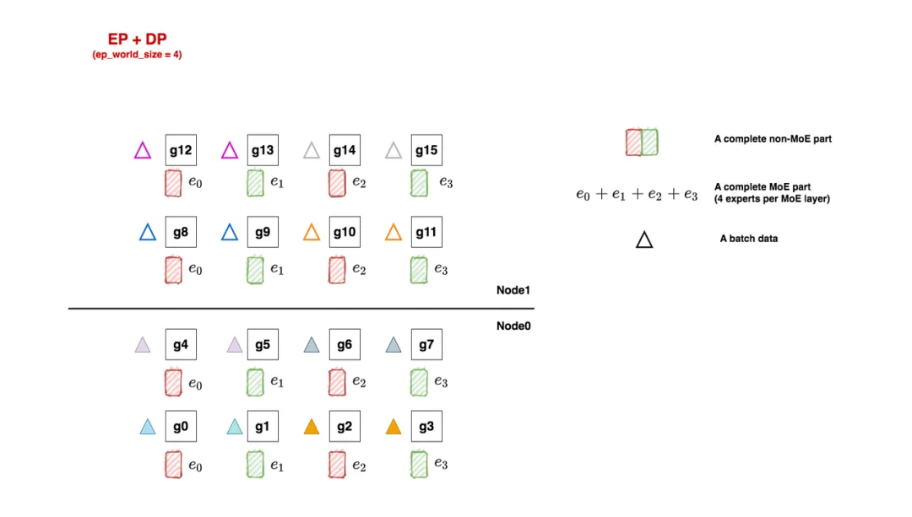

如图，三角形表示1个batch的数据，这里我们**共喂给模型8个batch**。每个tp组内的输入数据一致，所以它们对应的三角形颜色也相同。

好，**让我们牢记分布式并行的使命**：分布式训练效果应与单卡（假设这个单卡能装下一个完整的模型）的训练效果一致。放到我们的例子里，**16卡吃8个小batch做完FWD+BWD后的结果，应该与单卡吃下由这8个小batch组成的大batch的结果一致。**

现在开始做FWD与BWD，过程如下图：

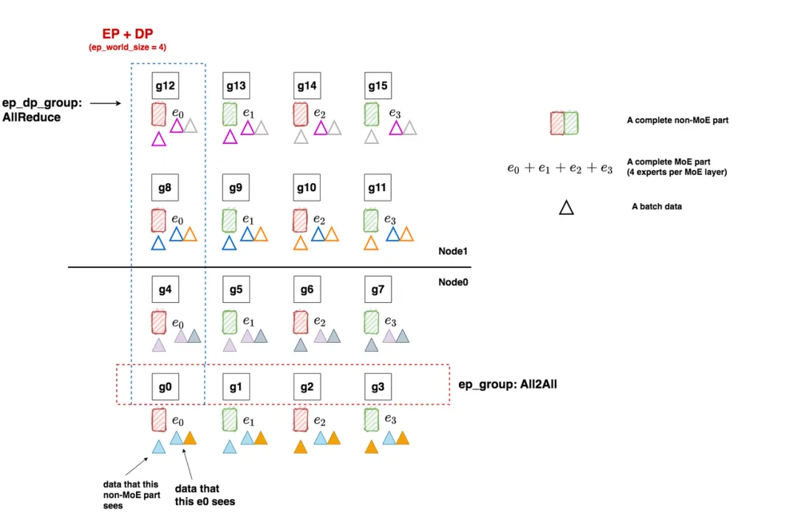

- 在FWD中，数据先过non-MoE（Attention）层，由于一个tp组内每块卡的输出也是一致的，因此三角形颜色的分布没有改变。**我们把三角形移动到对应的non-MoE分块下，表示在整个FWD中对应的non-MoE分块见过的batch。**
- 继续做FWD，现在数据来到了MoE层，我们前面说过，每块卡上数据的维度是(E, C, M)，**即我们已经计算好token和专家的对应关系，我们只需在ep_group内做all2all通讯，将token发送去对应的专家即可，这就是ep_group的作用。**all2all通讯的细节我们放在后面说，**这里只需记住在all2all通讯后，ep_group内每个专家见过的batch有了改变，例如对e0，现在它见过了蓝色和橘色两个batch的数据。**每个专家计算完自己的结果后，再通过all2all的方式，将对应的token计算结果还给ep_group内的各gpu，然后继续mon-MoE->MoE的步骤，知道FWD完毕。
- 做完了FWD，进入BWD。我们首先来到MoE部分，以e0为例，根据分布式训练使命，我们应该allreduce 8个batch的梯度结果，用来更新e0。欸那这8个batch在哪里呢？当然是在图中的ep_dp_group内！**所以在BWD过程中，我们对ep_dp_group中e0的梯度做allreduce，用来更新e0。**现在，你是不是更好理解ep_group的作用了！
- 继续做BWD，数据来到了non-MoE部分，这块对梯度的通讯我们在Megatron解析中已经讲了很多，这里就不再说明了。

总结一下针对MoE部分的重点：

- **在FWD中，ep_group进行all2all通讯，将token发去对应的专家做计算，并将计算结果取回。**
- **在BWD中，ep_dp_group进行AllReduce通讯梯度，用于更新对应的专家的参数。**

**对于这种在non-MoE部分采用tp，在MoE部分不采用tp的设计，在代码实现上有几个点要注意。**举例来说，对non-MoE来说，[g0, g1]是一个tp组，我们要对这两块卡的输出做AllReduce。但是对MoE部分而言，[g0, g1]的输出是不需要做AllReduce的。看过Megatron代码的朋友，应该能想起这块相关的操作在RowParallelLinear/ColumnParallelLinear模块下，所以在deepspeed中，通过传入一个enable_expert_tensor_parallelism=True/False的参数来做相关调整，这点我们放在源码解读篇中说。

**在一些代码框架（例如Megatron）中，为了多复用已有的并行方式，少做修改，一般都会做些强硬限制：**例如MoE的mp（tp与pp）层面的并行设置须与non-MoE的mp设置保持一致，即如果non-MoE做了tp切分，MoE也必须以同样的方式做tp切分，在此基础上再去安排MoE的ep/ep_data等等并行。在这样的限制下，如果non-MoE采用dp，那么MoE只能用ep+dp；如果non-MoE采用tp+dp，那么MoE只能采用ep+tp+dp；**欸发现了没有！这是不是和你我对ep+tp+dp这个符号表示的初印象很像？即tp+dp是non-MoE的并行方式，ep是MoE的并行方式。所以这样的理解，在某些代码框架上是通的，但是到别的更为灵活的代码实现上，就产生矛盾了。这也为什么我在本章开头说明，最好统一把这个符号理解成是对MoE部分并行方式的描述。**

对于non-MoE只采用dp，MoE采用ep+dp的设计，比较简单，这里我们就不多说了，大家可以自己画画。

## 3.2 All2All通讯

在3.1中，我们说过每张卡进MoE前的输入数据尺寸为`(E, C, M)`，其中E表示expert_num，C表示capacity，M表示token_embedding。在每个ep_group内，我们通过all2all通讯将token发去指定的expert做计算，再通过all2all通讯将计算结果返回。现在我们来介绍all2all的细节。

### （1）基础All2All

我们先来看基础All2All是怎么做的，再来看deepspeed改进后的All2All是怎么做的。

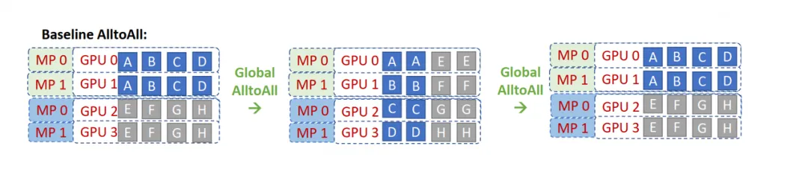

图中的MP表示的就是TP（在deepspeed的语系中，MP=TP），图中相关的分布式group为：

- tp_group: [[g0, g1], [g2,g3]]
- ep_group: [[g0,g1,g2,g3]]，也就意味**四张卡上分别存着e0, e1, e2, e3**

**我们先来看最左侧的图，它描绘了数据刚过完non-MoE(Attention)层后的结果。**因为tp组间做了AllReduce，所以g0和g1上存的数据完全一致（ABCD），g2和g3上存的数据完全一致(EFGH)。我们以[g0,g1]为例，因为有4个专家，所以图中将数据分为ABCD四份，每一份的维度为(C, M)，四份总维度为(E, C, M)。也就是说A的数据要发去e0，B的数据要发去e1，以此类推。

**我们再来看中间的图，它描绘了ep_group内首次做all2all的过程，这个过程的目的是将token发去对应的expert上进行计算。**你是否已经发现，a**ll2all就相当于做了一次矩阵转置**（对比一下左侧图和中间图的数据块排布）？因此通过All2All，我们就让数据块去到了它对应的位置：AE去e0，BF去e1，以此类推。而为了实现这种转置，我们必须提前对non-MoE做分块排序，让它按照要去的专家位置排好，现在你是不是能感受到排序的意义了？

**最后来看右侧的图，它描绘了ep_group内第二次做all2all的过程，这个过程的目的是将MoE算完的token再返回给各卡**，原理和上述一致。

一切都进行地很顺利，但我们能不能再做些优化呢？**例如，属于一个tp组的g0和g1上存着一模一样的数据，在all2all的过程中是会被重复发送和计算的，我们能不能减少这种重复？**

### （2）改进All2All，理论版

为了避免tp组内的数据重复发送的问题，deepspeed在论文中提出了一种改进版的All2All算法，但值得一提的是，deepspeed在代码实现中可不是完全按照这种改进算法来的（手动狗头，虽然实现上还是借鉴了一些理论上的思路）。所以本节我们先来看deepspeed在理论上的改进，然后再来看它的实操。

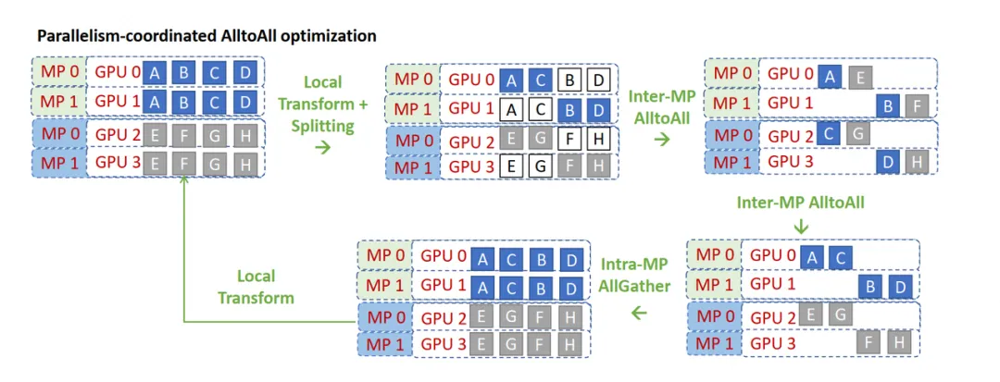

咱们来看看这张图，**确实是维持了deepspeed团队一贯的禅意风格：以培养读者悟性为宗旨，能不点破就不点破。**所以我们也不要辜负他们的期望，努力地悟一悟吧！

**deepspeed改进版all2all的核心宗旨是：既然你说tp组间的数据重复，那么我就在tp组间砍一刀，让tp组内的每块卡都维护不同的数据，不就不行了么？**于是我把g0上的CD砍掉，g1上的AB砍掉，以此类推。这下完美了吧，每块卡上只有2块数据且不重复了！

**但这样一来，all2all要怎么做呢？**你现在每张卡上只有2个数据块，但是all2all group内一共4块卡，如果你想正常做all2all，必须卡上的数据块和卡数相同才行，否则就会出现问题。

**所以，我们再想另一个办法：如果现在卡上只有两块数据了，那我如果把all2all group也一分为二，每个group内2张卡，一共两个all2all group，不就能解决这个问题了吗？**那这个新的all2all group要怎么设呢？最简单的方法就是，tp rank相同的卡组成一个新的all2all group。例如对g0和g2，它们的tp_rank都是0，所以它们组成新的all2all组，g1和g3也是同理。所以现在，我们只需对[g0, g2] all2all，[g1, g3] all2all就可以了。这也是为什么在图中把CB和FG交换位置的原因。

那如果我想[g0,g3] all2all，[g1,g2] all2all，然后把CD, GH交换位置，那可以么？理论上是没问题的，但是代码上这样写就不太优雅了，比不上同一个tp rank间all2all来得简便。

**知道了这个流程，我们再来看上面的图，是不是一目了然了？**图中local transform为改进版all2all作准备，交换了数据；两个all2all就是token发送和接受的过程；最后再加一个all-gather，因为tp组内每块卡的输出要保持一致，这样才能进入接下来的non-MoE层继续计算。

### （3）改进All2All，实操版

好，理论我们已经知道了。但你从改进的过程中肯定也发现了：原来是4卡all2all，现在是2卡all2all，**这不就把我辛苦设置好的ep_group破坏掉了吗？如果真的这么操作，那对代码的改动肯定是比较大的。**

**所以，有没有办法还是4卡all2all，但是也避免发送重复数据呢？**

当然有，大家想想我们每张卡的输出数据维度`(E, C, M)`，同个tp组内的所有卡这个`(E, C, M)`是一致的，此时你的脑子是不是灵光一现：**如果我沿着C把数据切成C/tp_world_size份，每张卡只保留其中的一分，那么不就既能做到tp组内卡上的数据不重复的情况下复用原来的ep_group做all2all吗？**在两次all2all后，我依然通过一个all-gather操作还原tp组内的完整数据，这不就行了吗？这就是deepspeed在代码实操中使用的方法。

deepspeed在代码中管这样的操作叫drop_tokens，大家注意和MoE理论部分所说的drop token区分开。

### （4）改进版All2All使用注意事项

在上面改进版All2All的讲解中，你可能已发现一个重要的点：虽然non-MoE采取了tp，但是MoE却没有用tp。

如果现在我把MoE也改成tp呢？g0存放，g1存放，g2存放，g3存放，即这里共2个专家，每个专家纵向切开为2，这种时候我们还需要采取drop tokens的方式吗？

**答案是否定的**，因为对于g0和g1来说，MoE层也被切开了，因此按照tp的方式，g0和g1上的输入各自过切开的MoE层后AllReduce的结果，才是最终结果。这时g0和g1上重复的输入数据是有实质意义的，我们不能drop。

**deepspeed禅师，你看我们这样算悟了吗？**

## 3.2 EP + DP + TP

### （1）Non-MoE与MoE

现在我们再回到ep并行设置的例子上来，我们考虑对专家也做tp切分。实现这一点最简单的逻辑是让专家的tp切分方式和非专家的tp切分方式一致，这样省得我们再去对MoE层多写一套tp组的分布式设置。


non-MoE组的并行设置和3.1一致，这里不再介绍，我们来看看MoE组的并行设置：

```
ep_world_size = 4，保持和3.1一致
ep_groups = [
            [g0, g2, g4, g6],
            [g1, g3, g5, g7],
            [g8, g10, g12, g14],
            [g9, g11, g13, g15]
           ]

ep_dp_world_size = 2
ep_dp_groups = [
                [g0, g8],
                [g1, g9],
                [g2, g10],
                [g3, g11],
                [g4, g12],
                [g5, g13],
                [g6, g14],
                [g7, g15]
                
# 复用non-MoE tp相关的并行设置
ep_tp_world_size = 2
ep_tp_groups = [...]
```

- **ep_groups**：在前面我们提过，**每个ep_groups中的每个ep_group装下一套“完整的”专家，但我们也留了个坑，说明“完整”的含义需要留后讨论。现在我们就来看看这个坑。**

- - **在deepspeed中**，虽然每个ep_group内的专家都是被纵向切开的，但只要它涉及到所有的专家，就认为它是“完整的”
  - **在Megatron中，**“完整”的含义就是参数完整，即g0~g7才被认为是一个ep_group。

**定义不同，组内的通讯方式自然也不同。在deepspeed的定义下，ep_group内做的是all2all；在megatron的定义下，做的是ReduceScatter和AllGather（事实上Megatron的MoE实现就没有用到all2all）**。这一点我们在源码讲解篇会来做比较。这里我先抛出我的结论：我认为deepspeed的ep_group设计是较好的，不仅操作上更符合直觉认知，还能避免重复数据发送（Megatron的实现方法会发送大量重复数据）。

### （2）FWD与BWD

同样，我们通过描述1次FWD与BWD的过程，来说明各个group间是怎么运作的。

- **首先做FWD，数据过non-MoE层**，因为采用了tp，所以相同tp组内的各卡输出一致，因此我们在图中将相同颜色的三角形放到对应的non-MoE参数块下。

- **继续做FWD，数据来到了MoE层**。在例子中：

- - **ep_group [g0, g2, g4, g6]和ep_group[g1, g3, g5, g7]内都各做1次all2all，将token发给对应的expert进行计算。**
  - 计算完毕后，因为MoE层也是tp并行的，**因此[g0, g1], [g2, g3], [g4, g5], [g6, g7]这几个tp组各自通过AllReduce取得完整的输出结果。**
  - 然后**ep_group [g0, g2, g4, g6]和ep_group[g1, g3, g5, g7]再做一次all2all，把计算完毕的数据发送回去，**以便进入下一个non-MoE->MoE操作。我们在图中把这一步骤里各卡维护的expert所见过的batch数据画在对应的expert下面。

- **开始做BWD，数据来到MoE层**。同一个ep_dp_group内的参数需要对梯度做AllReduce，例如图中[g0, g8]，这个group维护了相同的e，每个e都各自吃过4个batch的数据，联合起来刚好构成全局上的8个batch（牢记前文分布式训练的使命）.

- **继续做BWD，数据来到non-MoE层**，来到大家熟悉的领域了，tp+dp模式下的BWD，就不需要多说了吧。

## 3.3 PP去哪里了

在上面的例子中，我们见过了ep+tp+dp的混合，**你可能想问，pp也是一种常见的并行方式，它去哪里了呢？**

在MoE中，PP这个维度比较特殊，大部分论文和开源代码实践中，一般不考虑/不讨论再对MoE部分做pp切分。deepspeed中更是强制把PP维度设为1，并在代码注释里表示不支持PP（我猜这可能和deepspeed的zero实现有关，体感上可能会加剧通讯量，但我没做仔细研究，给不出确切答案）。我个人认为，如果tp+dp已经能满足显存限制的话，就不需要再引入pp将模型切得更碎了。同时在MoE模型中，你会发现non-MoE的模型副本数和MoE的模型副本数是不一致的。例如3.2的例子中，non-MoE有8个模型副本，但是MoE只有两个模型副本（g0~g7,  g8~g15），却也能实现8个完整的non-MoE + MoE模型副本的分布式训练效果。从这一点上看tp+dp形式的训练方式已经基本够用了。

但并不是说不能使用pp，Megatron中就支持pp的使用，我们来看下引入pp后的情况（图中标题给错了，应该是EP+TP+DP+PP，太懒了没有改，大家凑合看）：

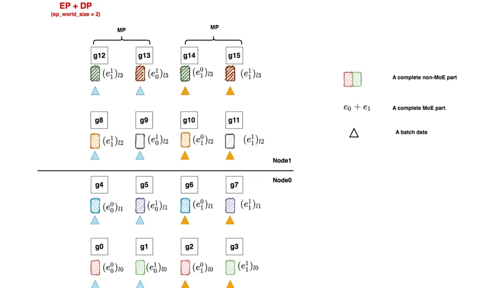

- non-MoE层采用tp + dp +pp并行（就是我们在Megatron解读中举的例子，是我们熟悉的味道）
- MoE层采用ep + tp +pp + dp，其中tp_group和tp_group直接复用non-MoE的设置

相信通过之前的讲解，大家已经能轻松看懂这张图了。这里只强调三点：

- ep_dp_groups = [[g0], [g1], [g2],...]，也就是每张卡单独组成了一个ep_dp_group（如果你觉得难以理解，就用前面说的每个e见过的batch来分析看看）
- ep_group = [[g0, g1, g2, g3], [g4, g5, g6, g7],...]，这个不难理解，想想上文说的Megatron对“完整的一套专家“的定义。
- 需要满足dp_world_size % ep_world_size == 0，事实上这也是Megatron并行设置的前置条件（不管你有没有使用pp，因为Megatron强制MoE复用non-MoE的并行配制，在此基础上再引入和ep相关的并行）。一般而言，world_size = tp_world_size * pp_world_szie * dp_world_szie，如果你的MoE层复用了non-MoE的tp和pp，那么ep_world_size只能在dp_world_size上做切割了。


# 一、DeepSpeed MoE

## 1.1 执行脚本

**执行脚本：Megatron-DeepSpeed/examples_deepspeed/MoE/ds_pretrain_gpt_1.3B_MoE128.sh**

在deepspeed中，一共实现了两类MoE架构：

- **普通MoE**：每个MoE层的专家数相等。因此你传入的num_expert可以是一个int
- **PR-MoE**：金字塔-残差连接型MoE（Pyramid-Residual MoE），这是deepspeed自己提出的创新模型，每个MoE层的专家数可以不等，因此你传入的应该是一个空格连接的字符串，即每层num_expert个数用空格隔开

这里我们只关注普通MoE。

这份sh脚本主要用于做参数配置，例如模型结构参数、分布式训练参数等等。这里主要关注分布式配置相关参数，其余可自行阅读。

```
megatron_options=" \
        --override-opt_param-scheduler \
        --adam-beta1 0.9 \
        --adam-beta2 0.95 \
        --tensor-model-parallel-size ${MP_SIZE} \
        --moe-expert-parallel-size ${EP_PARALLEL_SIZE} \
        --num-experts ${EP_SIZE} \
        --moe-loss-coeff ${MLC} \
        --moe-train-capacity-factor ${MOE_TRAIN_CAP_FACTOR} \
        --moe-eval-capacity-factor ${MOE_EVAL_CAP_FACTOR} \
        --moe-min-capacity ${MOE_MIN_CAP} \
        --......
```

- **tensor-model-parallel-size**：tp_world_size。由于在deepspeed moe实现中，默认pp_world_size = 1，则对于non-moe部分有dp_world_size = world_size / tp_world_size。
- **moe-expert-parallel-size**：ep_world_size。
- **num-experts**：每个MoE层专家数量。在普通MoE中，这是一个int（如128）；在PR-MoE中，其形式如"64 64 64 64 64 64 64 64 128 128"，表示每层的专家数量。**当num_expert = 1时，说明不采用MoE架构（我们管这种叫dense model，同理采用MoE则称为sparse model）**

对这些术语定义有疑惑的朋友，可以先看原理篇。

## 1.2 入口函数

**入口函数：Megatron-DeepSpeed/pretrain_gpt.py**

ds_pretrain_gpt_1.3B_MoE128.sh脚本启动的入口函数位于Megatron-DeepSpeed/pretrain_gpt.py中，**从这一步开始，整体代码就基本复用我们之前介绍过的Megatron框架了，只是在分布式环境和模型架构设计上会做些deepspeed特有的更改**。所以再次建议大家在阅读本文前先了解Megatron源码。

## 1.3 分布式环境初始化

**相关脚本：Megatron-DeepSpeed/megatron/initialize.py**

在Megatron中我们讲过相关的内容（TODO：插入链接），这里就不赘述了。**这份代码的主要作用就是将gpu划分成我们原理篇中说的各类group。**

**这里只提一个重要的点：deepspeed在这份脚本中，只对tp/pp/dp等group做了设置，对ep相关的group（例如原理篇中说的ep_group，ep_dp_group等）都没做相关设置。与之相反的是，Megatron在此处一次性把所有group都设置好了。**

**那么deepspeed在哪里设置ep相关的group呢？在“按分布式设置切割模型，并将模型搬运到gpu上”**这一环节（我们马上就在1.4中说明）。**为什么deepspeed要这么设计呢**？如果你使用过deepspeed，你一定对deepspeed.initialize()这个api非常熟悉，它的作用是使用deepspeed的方式对传入的model做包装，以便在训练中能对model做各类我们所熟悉的deepspeed优化操作（例如zero显存优化技术等）。deepspeed moe也算是deepspeed特有的操作的一种，所以放在deepspeed.initialize()中做设置。我认为在初始化上，deepspeed和megatron的代码实现没有什么优劣之分，只是一种设计习惯而已。大家在读不同代码时能读懂相关内容即可。

## 1.4  模型切割

**相关脚本：Megatron-DeepSpeed/megatron/training.py**

熟悉Megatron的朋友应该能记起，在做完分布式初始化后，我们就按照初始化设计好的方式，切割我们的模型，并将其搬运到GPU上，我们来看这一步的核心函数setup_model_and_optimizer（只摘取关键代码做讲解）

```
def setup_model_and_optimizer(model_provider_func,
                              model_type,
                              no_wd_decay_cond=None,
                              scale_lr_cond=None,
                              lr_mult=1.0,
                              teacher=False,
                              data_post_process=None,
                              build_train_valid_test_datasets_provider=None):
    """Setup model and optimizer."""
    
   args = get_args()

   # 根据当前rank，切割好的模型
   model = get_model(model_provider_func, model_type)
   
   ...
   if args.deepspeed:
       ....
           ....
              # 使用deepspeed做初始化 
               model, optimizer, args.deepspeed_dataloader, opt_param_scheduler = deepspeed.initialize(
                model=model[0],
                optimizer=optimizer,
                args=args,
                lr_scheduler=opt_param_scheduler,
                training_data=train_ds,
                mpu=mpu if args.no_pipeline_parallel else None,
                config=args.deepspeed_config_dict,
            )
```

- `get_model`：**定义当前进程所属的gpu所要维护的模型块**。我们在Megatron源码解读中专门写过一篇来介绍它，和MoE层相关的定义也由它来完成，下文我们会详细解读。
- `deepspeed.initialize()`：使用deepspeed来初始化定义好的模型，以便模型在训练中能使用deepspeed相关的优化操作。我们在1.3中说过，**deepspeed MoE实现中，对MoE层分布式设置的部分（即设置各种ep并行组）都由deepspeed.initialize()来完成**，我们详细来看下它是怎么做的，具体代码在DeepSpeed/deepspeed/runtime/engine.py，**注意这里换了一个仓库**，从Megatron-DeepSpeed仓库换到DeepSpeed仓库下，核心代码如下：

```
        # Set deepspeed parallelism spec. for the model including expert parallelism
        for _, module in self.module.named_modules():
            if hasattr(module, 'set_deepspeed_parallelism'):
                module.set_deepspeed_parallelism(self._config.use_data_before_expert_parallel_)
```

这段代码的意思是，**如果当前你定义的模型（module）中含有属性set_deepspeed_parallelism，说明这个模型会用到deepspeed自定义的分布式设置方法**，这时我们对模型执行set_deepspeed_parallelism()方法就可以完成相关初始化设置了。现在看不懂也没关系，后文我们在介绍MoE层切块模型架构定义的时候，会同时介绍这个方法详细的代码实现。

好，**到这里我们稍微总结下deepspeed MoE的代码流程**：

- **在分布式设置环节**，deepspeed MoE基本复用了Megatron分布式设置逻辑，但并没有对ep相关的并行组做设置
- **在模型切割环节**，deepspeed MoE自定义了MoE部分的模型架构，并通过deepspeed.initialize方法对模型设置ep相关的并行组。

## 1.5 MoELayer

### （1）整体框架

**相关脚本：Megatron-DeepSpeed/megatron/model/transformer.py**

现在，我们可以来看deepspeed是怎么定义它的MoE层了。

先简单回顾一下之前在Megatron源码解读时，画过的模型架构部分的层级关系：


**图中每个红虚线框表示一块gpu/一个进程定义的模型块。**我们知道MoE层其实是对原来MLP层的替换，所以主要改动应该在ParallelMLP相关的代码下。我们以ParallelTransformerLayer为入口，来看一步步看下细节。

```
class ParallelTransformerLayer(MegatronModule):
    """A single transformer layer.

    Transformer layer takes input with size [s, b, h] and returns an
    output of the same size.
    """

    def __init__(self, config,
                 layer_number, layer_type=LayerType.encoder,
                 self_attn_mask_type=AttnMaskType.padding,
                 drop_path_rate=0., num_experts=1):
        ......
        # -------------------------------------------------------------------
        # Attention (non-MoE)部分
        # -------------------------------------------------------------------
        self.self_attention = ParallelAttention(
            config,
            layer_number,
            attention_type=AttnType.self_attn,
            attn_mask_type=self_attn_mask_type)
        
        ......

        # -------------------------------------------------------------------
        # MLP（MoE）部分，提供三种MLP定义方式
        # 1、SwitchMLP：Megatron设计的MoE架构
        # 2、普通MLP：当num_expert=1时，说明该模型不是MoE，只是一个普通的dense MLP层
        # 3、deepspeed MoE：deepspeed自定义的MoE架构
        # -------------------------------------------------------------------
        self.num_experts = num_experts
        if args.num_experts_switch is not None:
            self.mlp = SwitchMLP(config) # 1. Megatron-LM's MoE
        else:
            if self.num_experts <= 1: # 2. dense, not MoE
                self.mlp = ParallelMLP(config)
            else: # 3. DeepSpeed's MoE
                # enable_expert_tensor_parallelism：表示是否要对专家做tp切分
                enable_expert_tensor_parallelism = args.enable_expert_tensor_parallelism
                self.mlp = MoE(args.hidden_size, # token_embedding
                               # 定义单个专家
                               ParallelMLP(config,
                                            moe=True,
                                            enable_expert_tensor_parallelism=enable_expert_tensor_parallelism),
                                num_experts=self.num_experts, # 每层专家总数
                                ep_size=args.moe_expert_parallel_size, # ep_world_size
                                k=args.topk, # topKEpert中的K，deepspeed使用Gshard模型，一般而言K=2，但也提供了K=1时方法
                                use_residual=(args.mlp_type == 'residual'), # deepspeed自创的PR-MoE架构中提出的方法
                                capacity_factor=args.moe_train_capacity_factor, # train过程中expert的capacity factor
                                eval_capacity_factor=args.moe_eval_capacity_factor, # eval过程中expert的capacity factor
                                min_capacity=args.moe_min_capacity, # expert最少需要达到的capacity
                                drop_tokens=args.moe_token_dropping, # 是否需要对tokens做溢出处理
                                use_tutel=args.use_tutel, # 是否需要使用tutel路由优化方法
                                enable_expert_tensor_parallelism=enable_expert_tensor_parallelism # 是否需要对专家层做tp切分
                                )
        ......
```

我们重点关注由deepspeed实现的MoE（Megatron实现的MoE我们放在后文说）。详细的解释都在代码注释中了，这里再额外提几点：

- `ParallelMLP()`：**定义单个expert的模型架构**。我们知道1个expert其实也是1个mlp模块，一层MoE由若干个这样的expert/mlp组成。如果不对expert做tp切分，那么这里定义的就是完整的expert架构；如果对expert做tp切分，那么这里定义的就是对原始expert纵向切成tp_world_size块后某一块expert的架构。

**回到上图中，你将图中的ParallelMLP层替换成一个MoE层，再在其中装入若干块ParallelMLP，就能将其改装成MoE模型下的分布式架构。**

- `use_residual`：前文说过，**deepspeed提出了一种叫PR-MoE的模型架构，这个函数就是指代其中的“R”**。PR-MoE架构图见下，首先，**Pyramid（P）允许为每层设置不同数量的专家。Residual（R）则表示一个固定的mlp模块（也可以理解成一个固定的专家）**，即所有的token都一定会经过这个mlp模块解析，除此以外再为每个token在剩下的专家中选出top1。deepspeed这样做的原因是：他们认为在top2Expert策略中，2nd expert是对1st expert的纠偏，也就是1st expert选得不一定正确，我们需要用2nd expert弥补一些信息回来。**那既然总要做纠偏，为何我不干脆把1st expert固定下来，然后只对2nd expert做选择呢？这就是R的意义。**

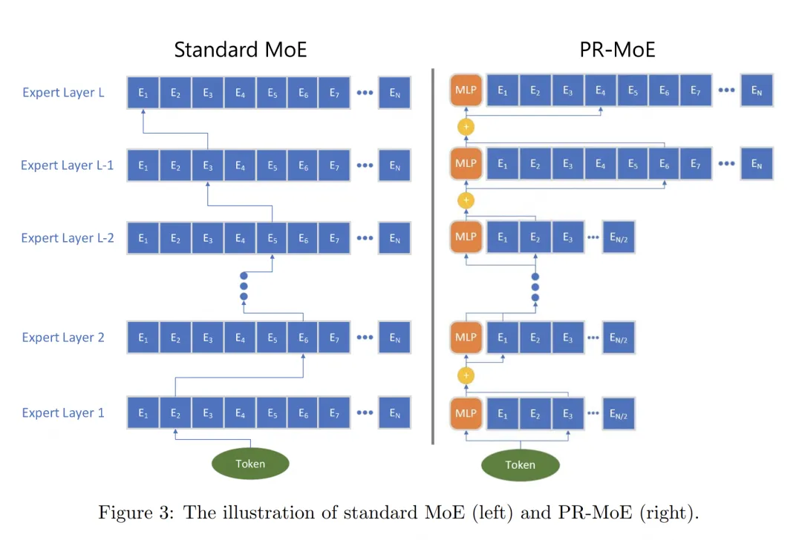

- `drop_tokens`：是否需要做溢出处理。在原理篇中我们讲过溢出的定义和溢出的处理方式，这里就不多说了。注意，这需要与all2all通讯中在同一个tp组内对输入做drop tokens的操作区分开。
- `use_tutel`：是否需要用tutel的路由优化方法。这个说来话长，可以单开一篇文章来讲了。在本文中可以暂时不关心，感兴趣的朋友可以自行阅读。

**下面，我们先来看单个expert(ParallelMLP)如何定义，再来看如何将其组装为一个MoE层。**

### （2）定义单个expert模型架构

单个expert模型架构的入口为`ParallelMLP()`，我们来看看它的代码。

```
class ParallelMLP(MegatronModule):
    """MLP.

    MLP will take the input with h hidden state, project it to 4*h
    hidden dimension, perform nonlinear transformation, and project the
    state back into h hidden dimension.
    """

    def __init__(self, config, moe=False, enable_expert_tensor_parallelism=False):
        ......
        # --------------------------------------------------------------------
        # self.dense_h_to_4h：Wi，尺寸大小(h, 4h/tp_world_size)
        # --------------------------------------------------------------------
        self.dense_h_to_4h = tensor_parallel.ColumnParallelLinear(
            config.hidden_size,
            ffn_hidden_size,
            config=config,
            init_method=config.init_method,
            bias=self.add_bias,
            gather_output=False,
            skip_bias_add=True,
            moe=moe,
            enable_expert_tensor_parallelism=enable_expert_tensor_parallelism
        )
        ......
        # --------------------------------------------------------------------
        # self.dense_4h_to_h, Wo, 尺寸大小为(4h/tp_world_size, h)
        # --------------------------------------------------------------------
        self.dense_4h_to_h = tensor_parallel.RowParallelLinear(
            config.ffn_hidden_size,
            config.hidden_size,
            config=config,
            init_method=config.output_layer_init_method,
            bias=self.add_bias,
            input_is_parallel=True,
            moe=moe,
            enable_expert_tensor_parallelism=enable_expert_tensor_parallelism
        )

    def forward(self, hidden_states):
        # --------------------------------------------------------------------
        # 输入数据过Wi层
        # [s, b, 4h/tp_word_size]
        # --------------------------------------------------------------------
        intermediate_parallel, bias_parallel = self.dense_h_to_4h(hidden_states)
        ......
        
        # --------------------------------------------------------------------
        # Wi层输出数据过Wo层
        # 在对expert采取tp切分的情况下，这里的输出需要在tp_group内做AllReduce
        # [s, b, h]
        # --------------------------------------------------------------------
        output, output_bias = self.dense_4h_to_h(intermediate_parallel)
        return output, output_bias
```

在原理篇我们说过，和普通MLP层一样，每个expert也是由Wi和Wo两个`nn.linear`层组成。其中Wi采用`ColumnParallelLinear`，Wo采用`RowParallelLinear`。如果每个专家是按tp维度切开的，那么数据过Wo层后的输出需要在对应tp_group内做AllReduce。

乍看之下这段代码似乎和没有MoE时长得差不多，这是因为入参`moe`和`enable_expert_tensor_parallelism`都是在`ColumnParallelLinear`和`RowParallelLinear`中起作用的，现在我们马上来看这两块的细节。

#### （a）ColumnParallelLinear

**相关脚本：Megatron-DeepSpeed/megatron/core/tensor_parallel/layers.py**

这里把列切割的原理再写一遍，方便大家对照着看：

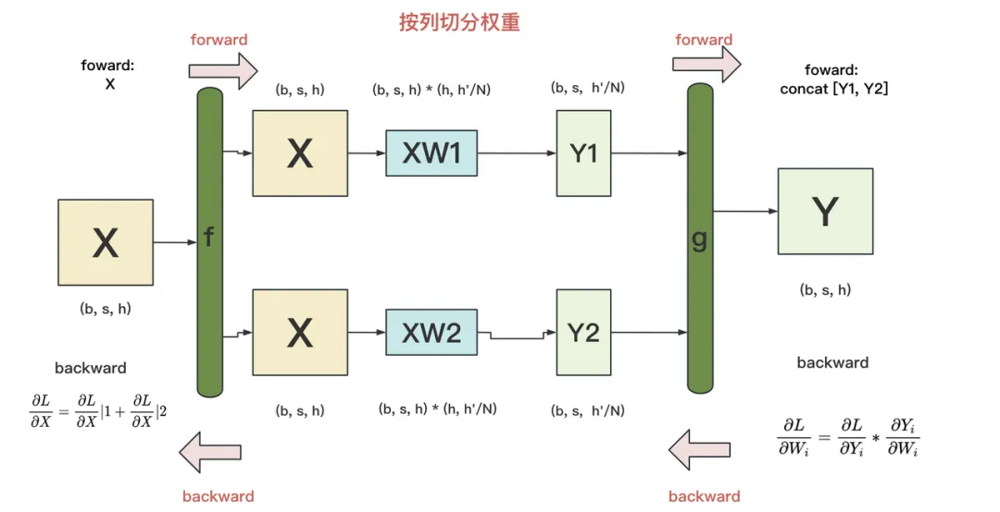

- `f和g` 是**两个共轭算子**，可理解为两个`torch.autograd.Function`类。在这个类下，我们可以**根据需要重写forward和backward方法。**
- `f` : **forward中，直接copy输入；backward中，对梯度做AllReduce**。在代码里定义为`class _CopyToModelParallelRegion(torch.autograd.Function)`
- `g`: **forward中，all-gather输出；backward中，对梯度做split**（每张卡经过all-gather已有完整的Y了，因此以Y为起点计算梯度后，沿着列做split就可得到Y1和Y2的梯度）。在代码里定义为class _GatherFromModelParallelRegion(torch.autograd.Function)

```
class ColumnParallelLinear(torch.nn.Module):
    """Linear layer with column parallelism.
    ......
    """

    def __init__(self, input_size, output_size, *,
                 config: ModelParallelConfig,
                 init_method: Callable,
                 bias=True, gather_output=False, stride=1,
                 keep_master_weight_for_test=False,
                 skip_bias_add=False,
                 skip_weight_param_allocation: bool=False,
                 moe=False, enable_expert_tensor_parallelism=False):
        torch.nn.Module.__init__(self)

        # Keep input parameters
        self.input_size = input_size
        self.output_size = output_size
        self.gather_output = gather_output
        # ---------------------------------------------------------------
        # 判断相关module是否表expert
        # 1、如果是moe，但不希望对expert做tp处理，则强制设tp_world_size = 1
        # 2、其余情况（非moe，或者是moe且希望对expert做tp处理），则复用non-Moe
        #    的tp_world_size
        # ---------------------------------------------------------------
        if moe and (not enable_expert_tensor_parallelism):
            world_size = 1
            self.is_expert_without_slicing = True
        else:
            world_size = get_tensor_model_parallel_world_size()
            self.is_expert_without_slicing = False

        self.output_size_per_partition = divide(output_size, world_size)
        self.skip_bias_add = skip_bias_add
        self.config = config
        ......
        
    def forward(self,
                input_: torch.Tensor,
                weight: Optional[torch.Tensor] = None):
        """Forward of ColumnParallelLinear
        ......
        """
        ......

        # ------------------------------------------------------------------------
        # 定义f算子
        # 1、如果expert未采用tp切分，则对expert的forward和backward方法不需要做任何修改
        # 2、如果expert采用tp切分，则需要对expert的forward和backward方法做修改
        #    具体为forward时直接copy input，backward时allreduce梯度
        #    可参考下放示意图
        # ------------------------------------------------------------------------
        if self.async_tensor_model_parallel_allreduce or \
                self.sequence_parallel or \
                self.is_expert_without_slicing: # non-expert only tensor parallelism
            input_parallel = input_
        else:
            input_parallel = copy_to_tensor_model_parallel_region(input_)
        
        # Matrix multiply.
        output_parallel = linear_with_grad_accumulation_and_async_allreduce(
            input=input_parallel,
            weight=weight,
            bias=bias,
            gradient_accumulation_fusion=self.gradient_accumulation_fusion,
            async_grad_allreduce=self.async_tensor_model_parallel_allreduce,
            sequence_parallel=self.sequence_parallel
        )
        
        # ------------------------------------------------------------------------
        # 定义g算子
        # 同理根据expert是否做了tp切分，决定要不要更改forward和backward方法
        # 需要注意，当你对单个expert做tp切分时，不管你的gather_output是True/False,
        # 单个expert的输出结果一定会在同个tp组内强制做allReduce
        # ------------------------------------------------------------------------
        if self.gather_output and not self.is_expert_without_slicing:
            # All-gather across the partitions.
            assert not self.sequence_parallel
            output = gather_from_tensor_model_parallel_region(output_parallel)
        else:
            output = output_parallel
        output_bias = self.bias if self.skip_bias_add else None
        return output, output_bias
```

#### （b）RowParallelLinear

这块关于expert的相关操作和ColumnParallelLinear差不多，也是针对“单个expert是否做了tp”这个条件做分类处理，具体代码留给读者自行阅读。

**好，到这里我们对单个expert的模型架构简单总结下**：

- **单个expert模型架构复用ParallelMLP定义，同时我们可根据需要决定单个expert是否要做tp切割**
- **单个expert不做tp切割，则不需要重写它的forward和backward方法**
- **单个expert做tp切割，则需要重写它的forward和backward方法，这和之前Megatron中做列切割和行切割的相关操作一致。**
- **单个expert做tp切割时，数据过单个expert后的输出结果一定会在同个tp_group内做AllReduce**

关于总结的第4点，我们再额外提几点：

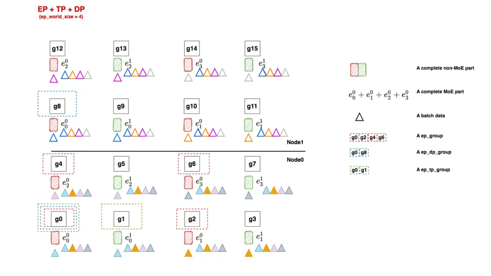

在之前原理篇的介绍中，我们提过FWD中数据过MoE层时各个group的通讯情况，具体如下：

**数据来到了MoE层**。在例子中：

1. **ep_group [g0, g2, g4, g6]和ep_group[g1, g3, g5, g7]内都各做1次all2all，将token发给对应的expert进行计算。**
2. 计算完毕后，因为MoE层也是tp并行的，**因此[g0, g1], [g2, g3], [g4, g5], [g6, g7]这几个tp组各自通过AllReduce取得完整的输出结果。**
3. 然后**ep_group [g0, g2, g4, g6]和ep_group[g1, g3, g5, g7]再做一次all2all，把计算完毕的数据发送回去，**以便进入下一个non-MoE->MoE操作。我们在图中把这一步骤里各卡维护的expert所见过的batch数据画在对应的expert下面。

**有朋友问：第2步和第3步可以换下顺序吗？即我先完成所有All2All的步骤，然后再对结果做AllReduce行不行呢？**从逻辑上来说是没问题的，但是从我们代码实现上来说，由于单个expert也是一个ParallelMLP模块，因此在expert也采用tp的情况下，做完FWD后数据一定是AllReduce的，因为这是定义在ParallelMLP的forward方法中的。这就是上面总结中强调第4点的含义。

#### （3）定义MoE层整体架构

**相关脚本：DeepSpeed/deepspeed/moe/layer.py**

我们已经知道了单个expert的定义，现在我们来看如何用单个expert组装起完整的MoE层。

```
class MoE(torch.nn.Module):
    """Initialize an MoE layer.

    Arguments:
        - 【hidden_size】 (int): token_embedding
        - 【expert】 (torch.nn.Module): 单个expert架构，属于ParallMLP类
        - 【num_experts】: 每层expert总数
        - 【ep_size】 (int, optional): default=1, ep_world_size
        - 【k】 (int, optional): default=1, topKexpert中的K，只支持K=1或2
        - 【capacity_factor】 (float, optional): default=1.0, train步骤的容量因子
        - 【eval_capacity_factor】 (float, optional): default=1.0, eval步骤的容量因子
        - 【min_capacity】 (int, optional): default=4, 每个专家最小的容量值
        - 【use_residual】 (bool, optional): default=False, 用于表示该层是否是一个residual expert层 (https://arxiv.org/abs/2201.05596) layer.
        - 【noisy_gate_policy】 (str, optional): default=None, noisy gate policy（加噪策略）, valid options are 'Jitter', 'RSample' or 'None'.
        - 【drop_tokens】 (bool, optional): default=True, whether to drop tokens - (setting to False is equivalent to infinite capacity).
        - 【use_rts】 (bool, optional): default=True, whether to use Random Token Selection.
        - 【use_tutel】 (bool, optional): default=False, whether to use Tutel optimizations (if installed).
        - 【enable_expert_tensor_parallelism】 (bool, optional): default=False, 是否对expert做tp切分
    """

    def __init__(self,
                 hidden_size,
                 expert,
                 num_experts=1,
                 ep_size=1,
                 k=1,
                 capacity_factor=1.,
                 eval_capacity_factor=1.,
                 min_capacity=4,
                 use_residual=False,
                 noisy_gate_policy: typing.Optional[str] = None,
                 drop_tokens: bool = True,
                 use_rts=True,
                 use_tutel: bool = False,
                 enable_expert_tensor_parallelism: bool = False):

        super(MoE, self).__init__()

        self.use_residual = use_residual
        self.enable_expert_tensor_parallelism = enable_expert_tensor_parallelism
        assert num_experts % ep_size == 0, f"Number of experts ({num_experts}) should be divisible by expert parallel size ({ep_size})"
        self.ep_size = ep_size
        self.expert_group_name = f"ep_size_{self.ep_size}"
        self.num_experts = num_experts
        # 单块gpu上需要存放的expert数量
        self.num_local_experts = num_experts // self.ep_size

        log_dist(
            f'Creating MoE layer with num_experts: {num_experts} | num_local_experts: {self.num_local_experts} | expert_parallel_size: {self.ep_size}',
            [0])

        assert noisy_gate_policy is None or noisy_gate_policy in ['None', 'Jitter', 'RSample'], \
            'Unsupported noisy_gate_policy: ' + noisy_gate_policy

        # -------------------------------------------------------------------------
        # 定义一个MoE层上所有的expert。见下面Experts类定义（很重要）
        # -------------------------------------------------------------------------
        experts = Experts(expert, self.num_local_experts, self.expert_group_name)
        
        # -------------------------------------------------------------------------
        # 定义MoE层
        # -------------------------------------------------------------------------
        self.deepspeed_moe = MOELayer(TopKGate(hidden_size, num_experts, k, capacity_factor, eval_capacity_factor,
                                               min_capacity, noisy_gate_policy, drop_tokens, use_rts),
                                      experts,
                                      self.expert_group_name,
                                      self.ep_size,
                                      self.num_local_experts,
                                      use_tutel=use_tutel)
        if self.use_residual:
            self.mlp = expert
            # coefficient is used for weighted sum of the output of expert and mlp
            self.coefficient = torch.nn.Linear(hidden_size, 2)

    def set_deepspeed_parallelism(self, use_data_before_expert_parallel_=False):
        """
        ep相关分布式设置。
        如前文所说，我们在deepspeed.initialize()中，如果检测到一个module拥有
        set_deepspeed_parallelism属性，则我们就对它执行相关的分布式设置操作
        """
        self._create_process_groups(use_data_before_expert_parallel_=use_data_before_expert_parallel_)

    def _create_process_groups(self, use_data_before_expert_parallel_=False):
        """
        ep相关分布式设置
        """
        # ----------------------------------------------------------------------------
        # 如果当前还未做ep相关分布式设置，那么就先做设置
        # ----------------------------------------------------------------------------
        if self.expert_group_name not in groups._get_expert_parallel_group_dict():
            print(f"No existing process group found, creating a new group named: {self.expert_group_name}")
            # ----------------------------------------------------------------------------
            # 1、当你没使用Megatron分布式并行，或者你使用了Megatron但又不想对expert组tp切分
            #    那么你就按EP + DP的方式设置ep相关group
            # ----------------------------------------------------------------------------
            if (groups.mpu is None) or (not self.enable_expert_tensor_parallelism):
                # Condition 1 - no groups.mpu means no tensor parallelism
                # Condition 2 - disabling expert tensor parallelism on purpose
                groups._create_expert_and_data_parallel(
                    self.ep_size, use_data_before_expert_parallel_=use_data_before_expert_parallel_)
            # ----------------------------------------------------------------------------
            # 2、其余情况则使用EP + DP + TP方式
            # ----------------------------------------------------------------------------
            else:
                # expert tensor parallelism is enabled
                groups._create_expert_data_and_model_parallel(
                    self.ep_size, mpu=groups.mpu, use_data_before_expert_parallel_=use_data_before_expert_parallel_)
        
        # ----------------------------------------------------------------------------
        # 在做完ep相关分布式设置的情况下，为当前进程所属的MoE层显示设置ep_group
        # 这样就可以在ep_group内做all2all通讯
        # 如果不显示设置ep_group，则默认是对所有gpu卡（world_size）做all2all
        # ----------------------------------------------------------------------------
        self.deepspeed_moe._set_ep_group(groups._get_expert_parallel_group(self.expert_group_name))

    def forward(self, hidden_states, used_token=None):
        """ MoE forward

        Arguments:
            hidden_states (Tensor): input to the layer
            used_token (Tensor, optional): default: None, mask only used tokens

        Returns:
            A tuple including output, gate loss, and expert count.

            * output (Tensor): output of the model

            * l_aux (Tensor): gate loss value

            * exp_counts (int): expert count
        """
        output = self.deepspeed_moe(hidden_states, used_token)
        if self.use_residual:
            # Residual MoE
            output_mlp = self.mlp(hidden_states)
            if type(output_mlp) is tuple:
                output_mlp = output_mlp[0]  # Ignore the bias term for now
            coef = self.coefficient(hidden_states)
            coef = torch.nn.functional.softmax(coef, dim=-1)
            output = output * coef[..., 0:1] + output_mlp * coef[..., 1:]
        return output, self.deepspeed_moe.l_aux, self.deepspeed_moe.exp_counts


class Experts(nn.Module):
    """
    相关脚本：DeepSpeed/deepspeed/moe/experts.py
    定义一个MoE层上所有的Expert
    """

    def __init__(self, expert: nn.Module, num_local_experts: int = 1, expert_group_name: Optional[str] = None) -> None:
        super(Experts, self).__init__()

        # ----------------------------------------------------------------------------
        # 每块gpu上共num_local_experts个expert
        # ----------------------------------------------------------------------------
        self.deepspeed_experts = nn.ModuleList([copy.deepcopy(expert) for _ in range(num_local_experts)])
        
        self.num_local_experts = num_local_experts

        # TODO: revisit allreduce for moe.gate...
        for expert in self.deepspeed_experts:
            # TODO: Create param groups to handle expert + data case (e.g. param.group = moe_group)
            for param in expert.parameters():
                param.allreduce = False
                param.group_name = expert_group_name

    def forward(self, inputs: torch.Tensor) -> torch.Tensor:
        """
        我们知道，在分发去experts前，每张卡上的输出结果为(E, C, M)，其中E=该MoE层专家总数，
        C = capacity，M = token embedding。
        
        设ep_world_size = G, num_local_experts = e, 则易知E = G * e
        
        对于All2All通讯，你可以理解成对于ep_group内的每张卡，都将数据沿着E维度切成G块后，再进行通讯。
        （保证每张卡上的数据块数量 = ep_world_size，这样All2All通讯才不会出错）
        
        因此发送完毕后，每张卡上的数据可以又表示为(G*e, C, M)
        
        进一步在正式把数据喂给这张卡上维护的experts前，我们可以把数据reshape成(G, e, C, M)的形式。
        
        此时如果我们沿着e维度将数据切分为e个chunck，则一个chunk对应一个local_expert，再次实现了token
        和local expert间一一对应的关系
 
        """
        # -------------------------------------------------------------------
        # 将input做切分后，将分块分别喂给该gpu上维护的若干个expert
        # inputs尺寸：(G, e, C, M)，
        #           G = ep_world_size
        #           e = num_local_experts，满足G*e = E，E为该层expert总数
        #           C = expert capacity, 
        #           M = token embedding
        # chunk_input: 沿着e维度切分inputs，方便各块input喂给该gpu上对应的各个expert  
        # -------------------------------------------------------------------                      
        chunks = inputs.chunk(self.num_local_experts, dim=1)
        expert_outputs: List[torch.Tensor] = []

        for chunk, expert in zip(chunks, self.deepspeed_experts):
            # out尺寸：（G, C, M）
            out = expert(chunk)
            if isinstance(out, tuple):
                out = out[0]  # Ignore the bias term for now
            expert_outputs += [out]

        # concat后最终out尺寸: (G, e, C, M)
        return torch.cat(expert_outputs, dim=1)
```

**细节都在注释中，我们不再赘述。这里只整理一下定义一个MoE层的整体流程**

- **首先，我们定义好了单个expert模型架构（ParallelMLP）**
- **然后，鉴于一张卡上可能不止维护1个expert（num_local_experts = num_experts // ep_world_size），我们需要定义这张卡上expert的集合Experts（nn.ModuleList，见代码细节）**
- **最后，我们需要一个TopKGate策略，来帮助token选择expert**
- **将以上内容组装成一个MOELayer**

#### （4）MOELayer与TopKGate

##### MOELayer

相关脚本：DeepSpeed/deepspeed/moe/sharded_moe.py

阅读本节时可以配合原理篇2.6部分的伪代码进行阅读（TODO：插入链接），deepspeed在MOELayer的实现上基本完全照搬了fairscale的实现方式，**细节都在注释中，这里不赘述。**

```
class MOELayer(Base):
    """MOELayer module which implements MixtureOfExperts as described in Gshard_.
    ::

        gate = TopKGate(model_dim, num_experts)
        moe = MOELayer(gate, expert)
        output = moe(input)
        l_aux = moe.l_aux

    .. Gshard_: https://arxiv.org/pdf/2006.16668.pdf

    Args:
        gate (torch.nn.Module):
            gate network
        expert (torch.nn.Module):
            expert network
    """

    def __init__(self,
                 gate: Module,
                 experts: Module,
                 ep_group_name,
                 ep_size,
                 num_local_experts: int,
                 use_tutel: bool = False) -> None:
        super().__init__()
        # -------------------------------------------------------------------------
        # TopKGate类，用来决定token的分法策略（细节见下文代码解读）
        # -------------------------------------------------------------------------
        self.gate = gate
        # -------------------------------------------------------------------------
        # 当前进程所属的gpu上维护的所有experts，nn.ModuleList[ParallelMLP()]
        # -------------------------------------------------------------------------
        self.experts = experts
        # -------------------------------------------------------------------------
        # 当前进程所属的ep_group，为None时表示所有的gpu构成一个ep_group
        # 当执行_set_ep_group方法时，可以自定义ep_group(参见MoE类下_create_process_groups方法)
        # -------------------------------------------------------------------------
        self.ep_group = None
        # -------------------------------------------------------------------------
        # 当前进程所属的ep_group的ep_world_size
        # -------------------------------------------------------------------------
        self.ep_size = ep_size
        # -------------------------------------------------------------------------
        # 当前进程所属的ep_group的名字
        # -------------------------------------------------------------------------
        self.ep_group_name = ep_group_name
        # -------------------------------------------------------------------------
        # 当前进程所属的gpu上所维护的experts数量，它即为self.experts中维护的experts数量
        # -------------------------------------------------------------------------
        self.num_local_experts = num_local_experts
        # -------------------------------------------------------------------------
        # 一些用于衡量MoE计算过程的时间技术器，可以忽略不看（后面代码中我都用省略号替换了）
        # -------------------------------------------------------------------------
        self.time_falltoall = 0.0
        self.time_salltoall = 0.0
        self.time_moe = 0.0
        self.timers = SynchronizedWallClockTimer()
        self.wall_clock_breakdown = False
        # 是否使用tutel做路由优化（tutel的实现细节我们不在本文中分析）    
        self.use_tutel = use_tutel and TUTEL_INSTALLED and gate.k == 1

        if self.use_tutel:
            logger.info('Using Tutel optimizations.')
        elif use_tutel and not TUTEL_INSTALLED:
            logger.warning("Tutel optimization requested but not installed. "
                           "Proceeding without Tutel.")
        elif use_tutel and TUTEL_INSTALLED and gate.k != 1:
            logger.warning("To enable Tutel optimization, use top-1 instead of top-2 gate. "
                           "Proceeding without Tutel.")

    def _set_ep_group(self, ep_group):
        self.ep_group = ep_group

    def forward(self, *input: Tensor, **kwargs: Any) -> Tensor:

        ......
        # -------------------------------------------------------------------------
        # 1. 对input做reshape
        # 注意入参中input前面带*号，意味着传入的input是一个tuple，一般是一个二元组
        # input[0]是我们真正要做计算的batch数据，其尺寸为(seq_len, batch_size, M)
        # input[1]是掩码数据，其尺寸为(seq_len*batch_size)，有时在计算MoE结果时，我们相对
        #         某些token做mask，使其不参与计算，就可以把mask数据装在这里。由于这一策略不常用，
        #         因此在本文中我们不关注这块
        # 
        # reshaped_input尺寸为(S, M)，其中S = seq_len * batch_size
        # -------------------------------------------------------------------------
        d_model = input[0].shape[-1]

        # Initial implementation -> Reshape into S tokens by dropping sequence dimension.
        # Reshape into G groups so that each group can distribute tokens equally
        # group_size = kwargs['group_size'] if 'group_size' in kwargs.keys() else 1
        reshaped_input = input[0].reshape(-1, d_model)

        # -------------------------------------------------------------------------
        # 是否使用Tutel做路由优化（不是本文讲解内容）
        # -------------------------------------------------------------------------
        if self.use_tutel:
            self.l_aux, C, E, indices_, locations_, gates_, self.exp_counts = self.gate(reshaped_input, input[1], True)
            S, M = reshaped_input.size(0), reshaped_input.size(1)

            if not hasattr(self, '_tutel_dispatcher'):
                self._tutel_dispatcher = tutel_moe.fast_dispatcher(E, C, M, dispatch_dtype=reshaped_input.dtype)
            self._tutel_dispatcher.update(indices_, locations_, gates_, capacity=C)
            dispatched_input = self._tutel_dispatcher.encode(reshaped_input)
        
        # -------------------------------------------------------------------------
        # 2. 使用自定义的Gshard gate，确定token的分法策略
        # （对以下输出结果解释有疑惑的，都可以参考原理篇2.6节伪代码讲解，有详细的图例）
        # gate：TopKGate类，后文做解读
        # l_aux: 辅助损失函数值
        # combine_weights: 尺寸为(S, E, C)，表示对每个token（S）而言，它对每个专家（E）的weight，
        #                  而这个weight按照该token在buffer中的位置（C）存放，不是目标位置的地方则用0填充
        # dispatch_mask：  它等于combine_weights.bool(), 也就是对combine_weights
        #                  为0的地方设为False，为1的地方设为True。
        #                   dispatch_mask后续将被用在zero padding上
        # -------------------------------------------------------------------------
        else:
            # 确认token分法策略
            self.l_aux, combine_weights, dispatch_mask, self.exp_counts = self.gate(reshaped_input, input[1])
            # -------------------------------------------------------------------------
            # 3. 将输入数据按照expert的顺序排好，并做zero padding,
            #    为下一步送去expert计算做准备（很重要）
            # dispatched_input: 尺寸为(E, C, M)，
            #                   表示每个专家（E）的buffer（C）下要处理的token_embedding（M），
            #                   当对应专家接收的token数不足buffer长度C时，不足的地方用0向量填充。
            # -------------------------------------------------------------------------
            dispatched_input = einsum("sec,sm->ecm", dispatch_mask.type_as(input[0]), reshaped_input)

        ......

        # -------------------------------------------------------------------------
        # 4. 当expert不采用tp切分，而non-MoE部分采用tp切分时，为避免数据重复发送，需要对
        #     同一个tp组内的tokens做去重（见原理篇3.2节）
        # -------------------------------------------------------------------------
        if groups._get_expert_model_parallel_world_size() == 1:
            # If the non-expert is tensor-parallel, it will create
            # duplicate tokens on the tensor-parallel ranks.
            # Since our experts are not tensor-parallel, these duplicates
            # need to be dropped to ensure correctness.
            # this also doubles up as a communication optimization as we are
            # reducing the all-to-all communication volume.
            dispatched_input = drop_tokens(dispatched_input, dim=1)

        # -------------------------------------------------------------------------
        # 5. 第一次All2All：将token发给对应的expert
        # dispatched_input尺寸为(E, C, M)，又可以写成(G*e, C, M)，
        # 其中G=ep_world_size, e = num_local_experts
        # 在将它正式喂给expert前，把它reshape成(G, e, C, M)
        # (参见1.5(3) Experts类注释)
        # -------------------------------------------------------------------------
        dispatched_input = _AllToAll.apply(self.ep_group, dispatched_input)
        ......
        # Re-shape after all-to-all: ECM -> GeCM
        dispatched_input = dispatched_input.reshape(self.ep_size, self.num_local_experts, -1, d_model)

        # -------------------------------------------------------------------------
        # 6. 将token喂给expert计算
        # expert_output尺寸为(G, e, C, M)
        # -------------------------------------------------------------------------
        expert_output = self.experts(dispatched_input)
        ......
        
        # -------------------------------------------------------------------------
        # 7. 第二次All2All：将算好的token返回给产出它的gpu
        # expert_output为(G, e, C, M)，即此时这张卡上维护的token过MoE的结果，
        # 是由它从ep_group（G）内所有expert(e)的结果汇总而来的
        # -------------------------------------------------------------------------
        expert_output = _AllToAll.apply(self.ep_group, expert_output)
        ......
        # Re-shape back: GeCM -> ECM
        expert_output = expert_output.reshape(self.ep_size * self.num_local_experts, -1, d_model)

        # -------------------------------------------------------------------------
        # 8. 如果之前在tp组内做过数据去重处理，这里要把数据all-gather回来
        #    （参见原理篇3.2）
        # -------------------------------------------------------------------------
        if groups._get_expert_model_parallel_world_size() == 1:
            # the dropped duplicate tokens need to be gathered on each
            # tensor parallel rank again for the tensor-parallel
            # non-expert of the next layer.
            expert_output = gather_tokens(expert_output, dim=1)

        # -------------------------------------------------------------------------
        # 9. 使用combine_weights进行加权计算
        # combined_output尺寸为(S, M），其中S = seq_len * batch_size
        # -------------------------------------------------------------------------
        if self.use_tutel:
            combined_output = self._tutel_dispatcher.decode(expert_output.view(E * C, M))
        else:
            combined_output = einsum("sec,ecm->sm", combine_weights.type_as(input[0]), expert_output)
        
        # 最终输出a尺寸为：(seq_len, batch_size, M)
        a = combined_output.reshape(input[0].shape)
        ......

        return a
```

##### TopKGate

TopKGate可以理解成是token的分发策略，它决定每个token要发去哪些expert，以及每个token在这些expert上的weight。

TopKGate实际其实就是一堆矩阵计算（包括在原理篇中我们提过的一些enisum算法），没有太多内容可写，大家可以对照着原理篇第二部分Gshard的架构解读（TODO：插入链接）来阅读代码。**这里有一个经验之谈：虽然TopKGate的主要思想不复杂，但是实现起来有些弯弯绕绕的，建议大家直接捏一些假数据，跑一遍相关代码，把一些关键变量打印出来，这样更有利于解读。**

**这里只额外提一点，是我认为deepspeed在实践中可能有点问题的地方，那就是对gate模块的初始化**，我们先来看下相关代码实践：

```
class TopKGate(Module):
    wg: torch.nn.Linear

    def __init__(self,
                 model_dim: int,
                 num_experts: int,
                 k: int = 1,
                 capacity_factor: float = 1.0,
                 eval_capacity_factor: float = 1.0,
                 min_capacity: int = 8,
                 noisy_gate_policy: Optional[str] = None,
                 drop_tokens: bool = True,
                 use_rts: bool = True) -> None:
        super().__init__()
        # Only top-1 and top-2 are supported at the moment.
        if k != 1 and k != 2:
            raise ValueError('Only top-1 and top-2 gatings are supported.')
        # 定义gate层架构
        self.wg = torch.nn.Linear(model_dim, num_experts, bias=False).float()
        
```

我们知道，gate的作用是计算每个token分发去各个expert上的prob，在deepspeed的设计中，每张卡上都会有一个gate模块。不难理解这个所有卡上这个gate模块应该是一模一样的，否则算法就会出现逻辑上的问题。

**而为了保证每卡上的gate一模一样，它们应该采取同样的初始化方式（例如采用相同初始化方法和初始化种子）**，但是但看deepspeed的这行代码实现，似乎并没有保障这一点。由于我没有完整阅读过deepspeed初始化的全部代码，不确定deepspeed是否在后续的包装过程中保证了这一点，因此觉得这里“可能”有些问题。

好！到这里为止，deepspeed moe实现的核心代码部分我们就讲完了，建议大家按这个流程将源码串起来读一遍，加深理解。接下来我们讲解Megatron moe的核心实现。

# 二、Megatron MoE

## 2.1 分布式环境初始化

**相关脚本：Megatron-LM/megatron/core/parallel_state.py**

在1.3中我们说过，deepspeed把ep相关的初始化设置放到模型切割之后，megatron则在模型切割之前一次性把包括ep在内的初始化都做完。我们先来回顾下原理篇中给出的一个megatron分布式设置的方式：

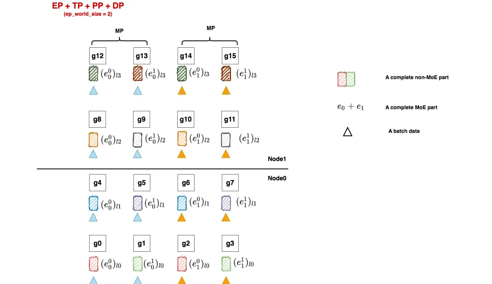

- non-MoE层采用tp + dp +pp并行
- MoE层采用ep + tp +pp + dp，其中tp_group和tp_group直接复用non-MoE的设置

对照着这张图，我们来看代码:

```
......
# -------------------------------------------------------------------------------
# ep_group
#  [[g0, g1, g2, g3], [g4, g5, g6, g7],[g8, g9, g10, g11], [g12, g13, g14, g15]]
# 假设当前进程为0，同样都是ep_world_size = 2的情况下：
# - 在Megatron中，当前进程对应的ep_group为[g0, g1, g2, g3]，
#                ep_group内通讯为ReduceScatter/AllGather(下文会细说)
# - 在deepspeed中，当前进程对应的ep_group为[g0, g2], 
#                 ep_group内通讯为All2All
# -------------------------------------------------------------------------------
_TENSOR_AND_EXPERT_PARALLEL_GROUP = None

# -------------------------------------------------------------------------------
# ep_dp_group
# [[g0], [g1], [g2],...], 每张卡单独组成1个ep_dp_group
# 对ep_dp_group定义有疑问的朋友，可先阅读原理篇第三部分
# deepspeed和megatron对ep_dp_group的定义是一致的
# -------------------------------------------------------------------------------
_DATA_MODULO_EXPERT_PARALLEL_GROUP = None # ep_dp_group
......

# -------------------------------------------------------------------------------
# 在megatron中，强制MoE部分复用non-MoE部分的tp和pp group，那么ep部分的划分就只能在
# dp维度上进行，所以需要强制data_parallel_size % expert_model_parallel_size == 0，
# 这里expert_model_parallel_size就是ep_world_size（注意在图例中ep_world_size是2不是4！）
# -------------------------------------------------------------------------------
if data_parallel_size % expert_model_parallel_size != 0:
raise RuntimeError(
            f"data_parallel_size ({data_parallel_size}) is not divisible by expert_model_parallel_size "
        )

# -------------------------------------------------------------------------------
# 具体划分_TENSOR_AND_EXPERT_PARALLEL_GROUP和_TENSOR_AND_EXPERT_PARALLEL_GROUP的代码
# 我们就不特别列出了，大家知道了这些group的定义后阅读起来应该不困难，
# 大家可以多尝试一些切分方式，跑一跑看看megatron会给出什么样的group，哪些组合是被megatron禁止的，
# 加深对代码理解
# -------------------------------------------------------------------------------
......
```

## 2.2 Megatron SwitchMLP

**相关脚本：Megatron-LM/megatron/model/transformer.py**

Megatron将其MOELayer的实现命名为SwitchMLP，与deepspeed的MOELayer相比主要有以下不同：

- **Megatron采取的是top1Expert策略**
- **Megatron是token dropless的，也就意味着所有的token都会被发送到其对应的1st expert上，不存在任何溢出问题**

第1点我们比较好理解，但是对于第2点我们就有困惑了：**在token dropless的情况下，megatron怎么解决expert间token负载不均的问题呢？这会影响它ep_group内的通讯吗？**

为了解答这些困惑，我们来详细画出Megatron SwitchMLP的流程图：

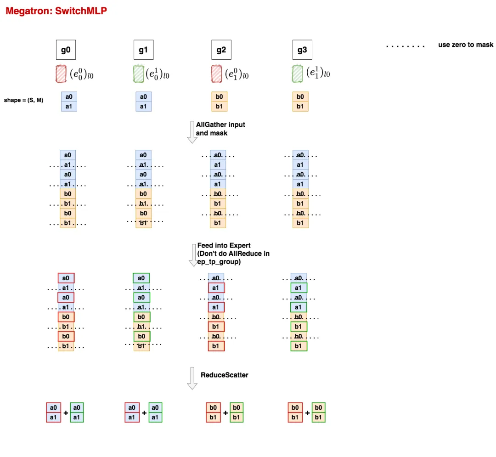

**这里我们只取pp切分后的某一layer来看，其余layer同理可推。**

1. 首先，non-moe层的输出结果尺寸为`(seq_len, batch_size, M)`，我们将其reshape为`(S, M)`，其中`S = seq_len * batch_size`。同一个tp组内的输出因为经过了AllReduce所以完全一致。以g0这块卡上的数据来说，我们假设a0是要送往e0的tokens，a2是要送往e1的tokens，其余gpu上也是类推，这样我们就得到了图例中的第一行。
2. **在ep_group内，对所有数据做AllGather，然后再把不是这块卡的expert维护的token给mask掉。**从这一步开始你就能发现Megatron和deepspeed的不同了：

- **deepspeed中，在对ep_group做All2All通讯时，token是定向发送到它对应的expert所在的卡上的**。因为不同expert维护的token数量不同，因此通讯时肯定有负载不均问题。为了解决这个问题，deepspeed对expert引入了capacity机制，可以理解成token是装在一个固定容量的容器（buffer）中发送的，容器中没装满的地方就用0填充。通过这种方式deepspeed解决了通讯时负载不均的问题。
- **Megatron中，对ep_group采用的是AllGather通讯，它才不管token对应的expert是哪个，它直接把数据全量发送到各卡上，然后再在各卡上mask掉不是这张卡的expert维护的token**，这样就能保证ep_group在通讯时负载均衡，缺点就是会发送大量的重复数据。通过这一步，大家是不是能更好理解deepspeed和Megatron中ep_group定义不同的原因了？

1. **在各卡上，当我们将不是这块卡expert维护的token mask掉后，我们就能把其余的token喂给expert了**（见图中第三行）。和deepspeed一样，**Megatron的单个expert也是ParallelMLP**。**但与deepspeed不同的是**，在Megatron中，如果一个expert采用了tp切分，那么在同一个tp组内，**我们不对expert的输出结果做AllReduce**，这样做是因为我们马上就要在ep_group内做ReduceScatter操作，这个操作自然会把expert不同tp组的结果相加起来。
2. **数据在MoE层计算完毕后，我们将数据每张卡上的数据划分为ep_world_size份**（注意，**这里ep_world_size是指Megatron ep_group内的卡数，其值为4。而我们分布式设置group组时这个ep_world_size为2**。大家阅读代码时可特别注意这一点），然后将卡上的数据做ReduceScatter，就能得到最终的结果了（图例中最后一行）。大**家可以发现现在同个tp组内的数据又完全一致了**，就可以将其当作输入喂给下一层non-MoE层了。

不难发现：

- **在ep_group内，Megatron通过AllGather + ReduceScatter的方式，替换掉了deepspeed All2All + expert buffer的形式，保持了ep_group内各卡通讯时的负载均衡**，但Megatron这样做的缺点就是发送了大量的重复数据
- **不管是deepspeed还是Megatron，它们只是解决了ep_group内通讯时的负载不均问题，但是实际计算时，每个expert拿到的有效token（即非zero padding的token）数量还是不一样的**，这一块我们一般通过辅助损失函数（原理篇中讲过）等方式来解决。

相信有了上面图例讲解，大家阅读Megatron SwitchMLP的代码就不困难了。这里我们不再把代码细节贴出（其实除了通讯外，就是一堆矩阵计算），留给大家自行阅读。

恭喜你竟然读完了这篇文章！**现在你是不是能感受到我曾经说的：MoE并行训练开源资料有一种鱼龙混杂，难成体系的感觉？**在原理篇和源码篇中，我尽量统一各种符号表达，明确定义，并努力将这个脉络理出来，希望对大家学习MoE并行能有所帮助。这里还遗留了一个坑，就是对Tutel优化的分析。这个就留到后续看看能不能出篇文章吧～
