# Seq2Seq

Seq2Seq 是一种循环神经网络的变种，包括编码器 (**Encoder**) 和解码器 (**Decoder**) 两部分。Seq2Seq 是自然语言处理中的一种重要模型，可以用于机器翻译、对话系统、自动文摘。

**1. RNN 结构及使用**

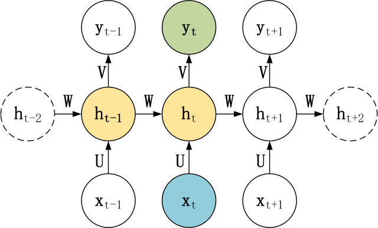RNN 模型

在之前的文章循环神经网络 RNN、LSTM、GRU中介绍了 RNN 模型，RNN 基本的模型如上图所示，每个神经元接受的输入包括：前一个神经元的隐藏层状态 **h**(用于记忆) 和当前的输入 **x** (当前信息)。神经元得到输入之后，会计算出新的隐藏状态 **h** 和输出 **y**，然后再传递到下一个神经元。因为隐藏状态 **h** 的存在，使得 RNN 具有一定的记忆功能。

针对不同任务，通常要对 RNN 模型结构进行少量的调整，根据输入和输出的数量，分为三种比较常见的结构：N vs N、1 vs N、N vs 1。

**1.1 N vs N**

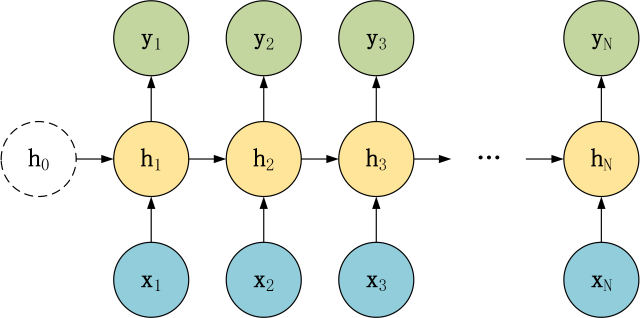N vs N 模型

上图是RNN 模型的一种 N vs N 结构，包含 N 个输入 **x**1, **x**2, ..., **x**N，和 N 个输出 **y**1, **y**2, ..., **y**N。N vs N 的结构中，**输入和输出序列的长度是相等的**，通常适合用于以下任务：

词性标注训练语言模型，使用之前的词预测下一个词等**1.2 1 vs N**

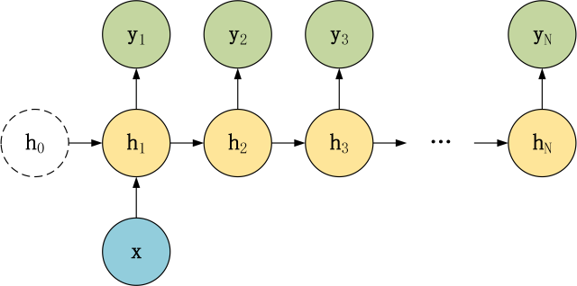1 vs N 模型(1)

1 vs N 模型(2)

在 1 vs N 结构中，我们只有一个输入 **x**，和 N 个输出 **y**1, **y**2, ..., **y**N。可以有两种方式使用 1 vs N，第一种只将输入 **x**传入第一个 RNN 神经元，第二种是将输入 **x** 传入所有的 RNN 神经元。1 vs N 结构适合用于以下任务：

图像生成文字，输入 **x** 就是一张图片，输出就是一段图片的描述文字。根据音乐类别，生成对应的音乐。根据小说类别，生成相应的小说。**1.3 N vs 1**

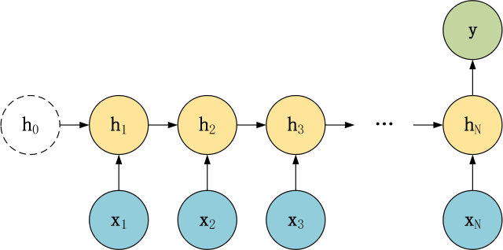N vs 1 模型

在 N vs 1 结构中，我们有 N 个输入 **x**1, **x**2, ..., **x**N，和一个输出 **y**。N vs 1 结构适合用于以下任务：

序列分类任务，一段语音、一段文字的类别，句子的情感分析。**2. Seq2Seq 模型**

**2.1 Seq2Seq 结构**

上面的三种结构对于 RNN 的输入和输出个数都有一定的限制，但实际中很多任务的序列的长度是不固定的，例如机器翻译中，源语言、目标语言的句子长度不一样；对话系统中，问句和答案的句子长度不一样。

Seq2Seq 是一种重要的 RNN 模型，也称为 Encoder-Decoder 模型，可以理解为一种 **N×M**的模型。模型包含两个部分：**Encoder** 用于编码序列的信息，将任意长度的序列信息编码到一个向量 **c** 里。而 **Decoder** 是解码器，解码器得到上下文信息向量 **c** 之后可以将信息解码，并输出为序列。Seq2Seq 模型结构有很多种，下面是几种比较常见的：

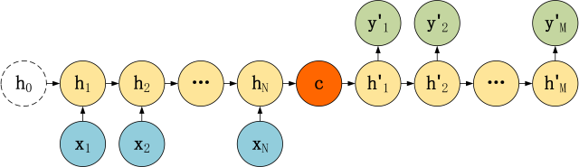第一种 Seq2Seq 模型

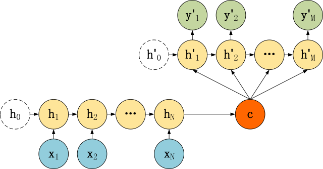第二种 Seq2Seq 模型

第三种 Seq2Seq 模型

**2.2 编码器 Encoder**

这三种 Seq2Seq 模型的主要区别在于 Decoder，他们的 Encoder 都是一样的。下图是 Encoder 部分，Encoder 的 RNN 接受输入 **x**，最终输出一个编码所有信息的上下文向量 **c**，中间的神经元没有输出。Decoder 主要传入的是上下文向量 **c**，然后解码出需要的信息。

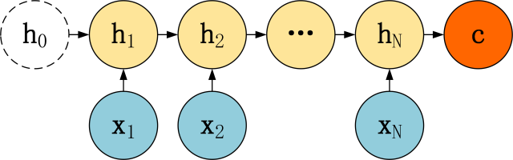Encoder

从上图可以看到，Encoder 与一般的 RNN 区别不大，只是中间神经元没有输出。其中的上下文向量 **c**可以采用多种方式进行计算。

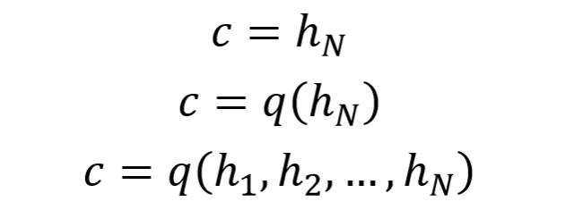上下文向量 c 计算公式

从公式可以看到，**c**可以直接使用最后一个神经元的隐藏状态 **h**N 表示；也可以在最后一个神经元的隐藏状态上进行某种变换 **h**N 而得到，q 函数表示某种变换；也可以使用所有神经元的隐藏状态 **h**1, **h**2, ..., **h**N 计算得到。得到上下文向量 **c** 之后，需要传递到 Decoder。

**2.3 解码器 Decoder**

Decoder 有多种不同的结构，这里主要介绍三种。

**第一种**

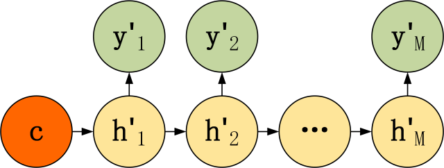第一种 Decoder 结构

第一种 Decoder 结构比较简单，将上下文向量 **c**当成是 RNN 的初始隐藏状态，输入到 RNN 中，后续只接受上一个神经元的隐藏层状态 **h'** 而不接收其他的输入 **x**。第一种 Decoder 结构的隐藏层及输出的计算公式：

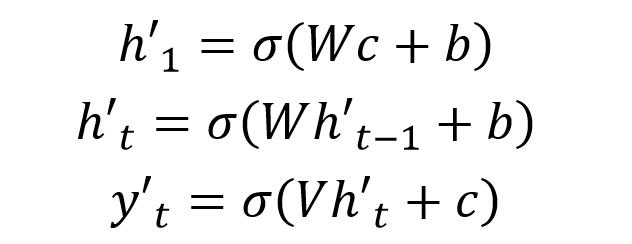第一种 Decoder 隐藏层及输出层

**第二种**

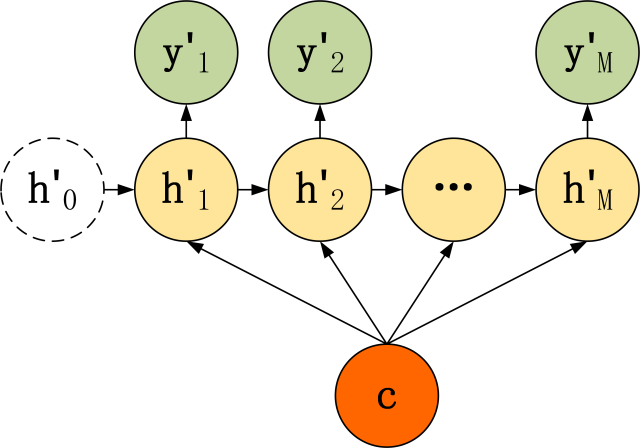第二种 Decoder 结构

第二种 Decoder 结构有了自己的初始隐藏层状态 **h'**0，不再把上下文向量 **c**当成是 RNN 的初始隐藏状态，而是当成 RNN 每一个神经元的输入。可以看到在 Decoder 的每一个神经元都拥有相同的输入 **c**，这种 Decoder 的隐藏层及输出计算公式：

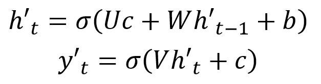第二种 Decoder 隐藏层及输出层

**第三种**

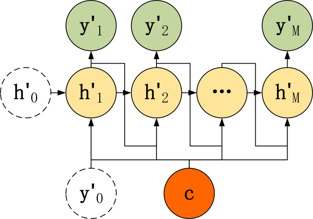第三种 Decoder 结构

第三种 Decoder 结构和第二种类似，但是在输入的部分多了上一个神经元的输出 **y'**。即每一个神经元的输入包括：上一个神经元的隐藏层向量 **h'**，上一个神经元的输出 **y'**，当前的输入 **c**(Encoder 编码的上下文向量)。对于第一个神经元的输入 **y'**0，通常是句子其实标志位的 embedding 向量。第三种 Decoder 的隐藏层及输出计算公式：

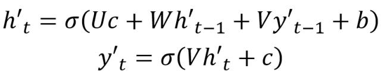第三种 Decoder 隐藏层及输出层

**3. Seq2Seq模型使用技巧**

**3.1 Teacher Forcing**

Teacher Forcing 用于训练阶段，主要针对上面第三种 Decoder 模型来说的，第三种 Decoder 模型神经元的输入包括了上一个神经元的输出 **y'**。如果上一个神经元的输出是错误的，则下一个神经元的输出也很容易错误，导致错误会一直传递下去。

而 Teacher Forcing 可以在一定程度上缓解上面的问题，在训练 Seq2Seq 模型时，Decoder 的每一个神经元并非一定使用上一个神经元的输出，而是有一定的比例采用正确的序列作为输入。

举例说明，在翻译任务中，给定英文句子翻译为中文。"I have a cat" 翻译成 "我有一只猫"，**下图是不使用 Teacher Forcing 的 Seq2Seq**：

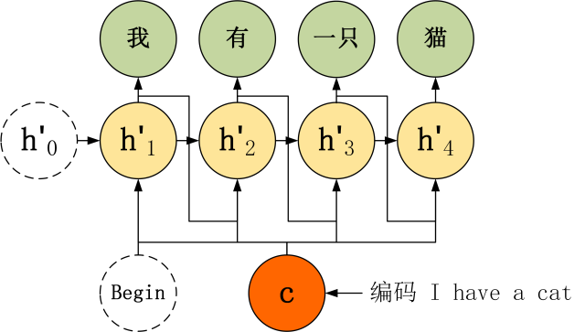不使用 Teacher Forcing 的 Seq2Seq

**如果使用 Teacher Forcing**，则神经元直接使用正确的输出作为当前神经元的输入。

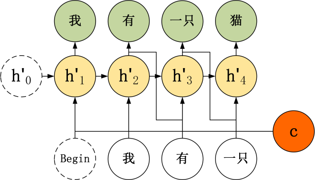不使用 Teacher Forcing 的 Seq2Seq

**3.2 Attention**

在 Seq2Seq 模型，Encoder 总是将源句子的所有信息编码到一个固定长度的上下文向量 **c**中，然后在 Decoder 解码的过程中向量 **c** 都是不变的。这存在着不少缺陷：

对于比较长的句子，很难用一个定长的向量 **c** 完全表示其意义。RNN 存在长序列梯度消失的问题，只使用最后一个神经元得到的向量 **c** 效果不理想。与人类的注意力方式不同，即人类在阅读文章的时候，会把注意力放在当前的句子上。Attention 即**注意力机制**，是一种将模型的注意力放在当前翻译单词上的一种机制。例如翻译 "I have a cat"，翻译到 "我" 时，要将注意力放在源句子的 "I" 上，翻译到 "猫" 时要将注意力放在源句子的 "cat" 上。

使用了 Attention 后，Decoder 的输入就不是固定的上下文向量 **c**了，而是会根据当前翻译的信息，计算当前的 **c**。

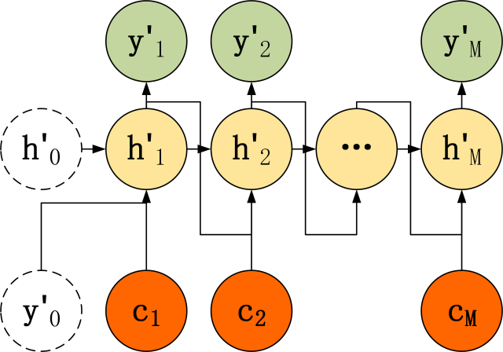添加 Attention 之后的 Decoder

Attention 需要保留 Encoder 每一个神经元的隐藏层向量 **h**，然后 Decoder 的第 t 个神经元要根据上一个神经元的隐藏层向量 **h'**t-1 计算出当前状态与 Encoder 每一个神经元的相关性 **e**t。**e**t 是一个 N 维的向量 (Encoder 神经元个数为 N)，若 **e**t 的第 i 维越大，则说明当前节点与 Encoder 第 i 个神经元的相关性越大。**e**t 的计算方法有很多种，即相关性系数的计算函数 a 有很多种：

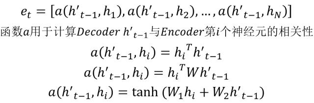Attention 相关性系数

上面得到相关性向量 **e**t 后，需要进行归一化，使用 softmax 归一化。然后用归一化后的系数融合 Encoder 的多个隐藏层向量得到 Decoder 当前神经元的上下文向量 **c**t：

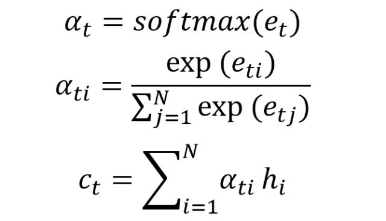Attention 上下文向量 c

**3.3 beam search**

beam search 方法不用于训练的过程，而是用在测试的。在每一个神经元中，我们都选取当前输出概率值最大的 **top k**个输出传递到下一个神经元。下一个神经元分别用这 k 个输出，计算出 L 个单词的概率 (L 为词汇表大小)，然后在 kL 个结果中得到 **top k** 个最大的输出，重复这一步骤。

**4. Seq2Seq 总结**

Seq2Seq 模型允许我们使用长度不同的输入和输出序列，适用范围相当广，可用于机器翻译，对话系统，阅读理解等场景。

Seq2Seq 模型使用时可以利用 Teacher Forceing，Attention，beam search 等方法优化。

